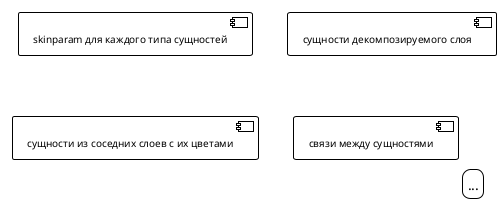

# Диаграммы ArchiMate — шаблон построения (H6)

> **Важно:** этот файл в `.requirements/**` — **методика** (read-only).
> Определяет правила построения ArchiMate диаграмм в PlantUML.
> **Подход:** `.approach/archimate.md` (концептуальная методология ArchiMate).

---

## 1. Когда строить диаграммы

**Предусловия:**
- Этап [7] Архитектура завершен (BL, AL, TL описаны)
- Готовность описаний >= 80% (см. `.requirements/архитектура/описание связи TL AL BL.md`)
- Формат диаграмм зафиксирован в `docs/requirements/обоснование выбора.md`

**Результат:**
- `docs/requirements/архитектура/diagrams/BL.plantuml`
- `docs/requirements/архитектура/diagrams/AL.plantuml`
- `docs/requirements/архитектура/diagrams/TL.plantuml`

---

## 2. Структура файла диаграммы



---

## 3. Цветовая схема (стандарт ArchiMate 3.2)

| Слой | Цвет | HEX | Назначение |
|------|------|-----|------------|
| Business Layer | Желтый | `#FFFACD` | Бизнес-процессы, акторы, сервисы, объекты |
| Application Layer | Голубой | `#B5E7F0` | Компоненты, интерфейсы, данные |
| Technology Layer | Зеленый | `#C9E7B7` | Узлы, устройства, артефакты |

### 3.1 Skinparam для слоев

```plantuml
' Business Layer — желтый
skinparam rectangle<<BusinessActor>> {
    BackgroundColor #FFFACD
    BorderColor #000000
    FontColor #000000
}
skinparam rectangle<<BusinessRole>> { BackgroundColor #FFFACD ... }
skinparam rectangle<<BusinessProcess>> { BackgroundColor #FFFACD ... }
skinparam rectangle<<BusinessService>> { BackgroundColor #FFFACD ... }
skinparam rectangle<<BusinessObject>> { BackgroundColor #FFFACD ... }
skinparam rectangle<<BusinessEvent>> { BackgroundColor #FFFACD ... }
skinparam rectangle<<BusinessInterface>> { BackgroundColor #FFFACD ... }

' Application Layer — голубой
skinparam rectangle<<ApplicationComponent>> { BackgroundColor #B5E7F0 ... }
skinparam rectangle<<ApplicationService>> { BackgroundColor #B5E7F0 ... }
skinparam rectangle<<ApplicationInterface>> { BackgroundColor #B5E7F0 ... }
skinparam rectangle<<ApplicationFunction>> { BackgroundColor #B5E7F0 ... }
skinparam rectangle<<DataObject>> { BackgroundColor #B5E7F0 ... }

' Technology Layer — зеленый
skinparam rectangle<<TechnologyNode>> { BackgroundColor #C9E7B7 ... }
skinparam rectangle<<TechnologyService>> { BackgroundColor #C9E7B7 ... }
skinparam rectangle<<TechnologyInterface>> { BackgroundColor #C9E7B7 ... }
skinparam rectangle<<SystemSoftware>> { BackgroundColor #C9E7B7 ... }
skinparam rectangle<<TechnologyArtifact>> { BackgroundColor #C9E7B7 ... }
skinparam rectangle<<Device>> { BackgroundColor #C9E7B7 ... }
```

---

## 4. Формат сущностей

```plantuml
rectangle "Название\n(ID)" as ID_Name <<ТипСущности>>
```

**Примеры:**
```plantuml
rectangle "Auth & IAM\n(Rust)\nAC4" as AC4_Auth <<ApplicationComponent>>
rectangle "Жилец\n(Ж)" as Actor_Resident <<BusinessActor>>
rectangle "PostgreSQL\n(TN2)" as TN2_PostgreSQL <<TechnologyNode>>
```

**Правила именования:**
- `as` — английский идентификатор: `AC4_Auth`, `TN2_PostgreSQL`
- Название в кавычках — русский текст
- ID в скобках для трассируемости

---

## 5. Типы связей

| Связь | Цвет | Стиль | Толщина | Назначение |
|-------|------|-------|---------|------------|
| `assignment` | `#000000` | solid | 2 | Актор -> Роль, Device -> Node |
| `serving` | `#4CAF50` | solid | 2 | Сервис -> Потребитель |
| `access` | `#2196F3` | solid | 1-2 | Компонент -> Данные |
| `realization` | `#FFA500` | dashed | 2 | Component -> Service |
| `triggering` | `#FF6B6B` | dashed | 2 | Событие -> Процесс |

### 5.1 Формат связей

```plantuml
' Сплошная линия
Source -[#4CAF50,thickness=2]-> Target : <color:#4CAF50>serving</color>

' Пунктирная линия
Source -[#FFA500,thickness=2,dashed]-> Target : <color:#FFA500>realization</color>
```

### 5.2 Группировка связей

```plantuml
' ========== СВЯЗИ: РОЛИ И ПРОЦЕССЫ (Serving) ==========
Role_Resident -[#4CAF50,thickness=2]-> P1_Register : <color:#4CAF50>serving</color>
Role_Admin -[#4CAF50,thickness=2]-> P10_Maintenance : <color:#4CAF50>serving</color>

' ========== МЕЖСЛОЙНЫЕ: TL → AL (Serving) ==========
TS1_MQTT -[#4CAF50,thickness=2]-> AC1_Gateway : <color:#4CAF50>serving</color>
TS2_Storage -[#4CAF50,thickness=2]-> AC7_Analytics : <color:#4CAF50>serving</color>
```

---

## 6. Межслойные связи

| Направление | Тип связи | Пример |
|-------------|-----------|--------|
| AL -> BL | `realization` | Application Service -> Business Service |
| TL -> AL | `serving` | Technology Service -> Application Component |
| Device -> Node | `assignment` | Physical Device -> Technology Node |
| Node -> SystemSoftware | `assignment` | Node -> OS/Container |
| SystemSoftware -> TechnologyService | `realization` | PostgreSQL -> Database Service |

---

## 7. Hub-паттерн (для сложных диаграмм)

Когда много связей к одному объекту — используй Hub для читаемости:

```plantuml
skinparam rectangle<<Hub>> {
    BackgroundColor #FFFFFF
    BorderColor #2196F3
    RoundCorner 12
    MinimumWidth 30
    MinimumHeight 18
}

rectangle "Hub\nProfile" as J_Profile <<Hub>>

' Много процессов обращаются к профилю
P1_Register -[#2196F3]-> J_Profile
P2_CoOwner -[#2196F3]-> J_Profile
P3_Profile -[#2196F3]-> J_Profile

' Один Hub -> объект
J_Profile -[#2196F3]-> O3_Profile : <color:#2196F3>access</color>
```

---

## 8. Легенда (обязательна)

```plantuml
legend right
|= Тип связи |= Цвет |= Стиль |
| Assignment | Черный | Сплошная |
| Serving | Зеленый | Сплошная |
| Access | Синий | Сплошная |
| Realization | Оранжевый | Пунктирная |
| Triggering | Красный | Пунктирная |
|  |  |  |
|= Слои |= Цвет |  |
| Business Layer (BL) | Желтый (#FFFACD) |  |
| Application Layer (AL) | Голубой (#B5E7F0) |  |
| Technology Layer (TL) | Зеленый (#C9E7B7) |  |
endlegend
```

---

## 9. Типы сущностей по слоям

### 9.1 Business Layer

| Тип | Описание | Пример |
|-----|----------|--------|
| `BusinessActor` | Внешний участник | Жилец, Администратор |
| `BusinessRole` | Внутренняя роль | Роль жильца |
| `BusinessProcess` | Процесс | Регистрация, Вход в систему |
| `BusinessService` | Сервис | Сервис аутентификации |
| `BusinessObject` | Объект данных | Профиль пользователя |
| `BusinessEvent` | Событие | Пользователь зарегистрирован |
| `BusinessInterface` | Интерфейс | Портал жилца |

### 9.2 Application Layer

| Тип | Описание | Пример |
|-----|----------|--------|
| `ApplicationComponent` | Компонент | API Gateway, Rule Engine |
| `ApplicationService` | Сервис | Auth Service |
| `ApplicationInterface` | Интерфейс | REST API, WebSocket |
| `ApplicationFunction` | Функция | Валидация токена |
| `DataObject` | Объект данных | Profile.json, Telemetry.json |

### 9.3 Technology Layer

| Тип | Описание | Пример |
|-----|----------|--------|
| `TechnologyNode` | Узел | Raspberry Pi, PostgreSQL Cluster |
| `Device` | Устройство | Raspberry Pi 4, UPS |
| `SystemSoftware` | Системное ПО | Ubuntu Server, Docker |
| `TechnologyService` | Сервис | MQTT Service, Database Service |
| `TechnologyInterface` | Интерфейс | MQTT 1883, PostgreSQL 5432 |
| `TechnologyArtifact` | Артефакт | docker-compose.yml, nginx.conf |

---

## 10. Порядок построения диаграмм

1. **BL.plantuml** — Business Layer
   - Акторы и роли
   - Процессы (из сценариев)
   - Бизнес-сервисы
   - Бизнес-объекты
   - События
   - Интерфейсы
   - Связи: assignment, serving, access, triggering

2. **AL.plantuml** — Application Layer
   - Компоненты (из AL описания)
   - Сервисы
   - Интерфейсы (REST, WS, MQTT)
   - DataObjects
   - Внешние: BL сервисы (желтые), TL сервисы (зеленые)
   - Связи: serving, access, realization (AL -> BL)

3. **TL.plantuml** — Technology Layer
   - Devices
   - Nodes
   - SystemSoftware
   - TechnologyServices
   - Interfaces (порты)
   - Artifacts (конфиги)
   - Внешние: AL компоненты (голубые)
   - Связи: assignment, serving, realization, access

---

## 11. Примеры (H7)

**Считать верным:**
- Диаграмма использует ID сущностей и цветовую схему слоёв.
- Связи соответствуют типам (serving/realization/assignment).

**Считать неверным:**
- Сущности без ID или диаграмма без легенды и цветовой схемы.

---

## 12. Чеклист диаграммы

- [ ] Используется `!theme plain`
- [ ] `skinparam` для всех типов сущностей
- [ ] Цвета соответствуют слоям
- [ ] Сущности имеют ID для трассируемости
- [ ] Связи сгруппированы по типам с комментариями
- [ ] Цвет связи соответствует типу
- [ ] Легенда присутствует
- [ ] Внешние сущности имеют цвет своего слоя
- [ ] Hub-паттерн для сложных связей (опционально)
- [ ] Диаграмма рендерится без ошибок

---

## Критерии готовности

- [ ] Чеклист диаграммы выполнен полностью
- [ ] Диаграммы сохранены в `docs/requirements/архитектура/`
- [ ] В диаграммах используются ID сущностей из реестра архитектуры
