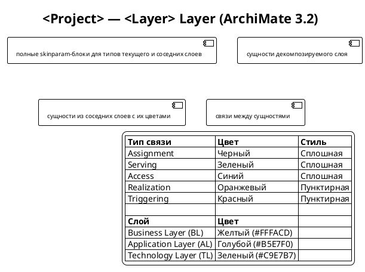

# Диаграммы ArchiMate — шаблон построения (H6)

> **Важно:** этот файл в `.requirements/**` — **методика** (read-only).
> Определяет правила построения ArchiMate диаграмм в PlantUML.
> **Подход:** `.approach/archimate.md` (концептуальная методология ArchiMate).

Перед созданием диаграмм обязательно изучи эталонные исходники:

- `.diagrams/example BL.plantuml` — стиль Business Layer;
- `.diagrams/example AL.plantuml` — стиль Application Layer;
- `.diagrams/example TL.plantuml` — стиль Technology Layer.

Эти файлы задают визуальную и структурную форму диаграмм. Их сущности,
названия, идентификаторы и связи являются только обезличенным примером и не
переносятся в диаграмму конкретного проекта.

---

## 1. Когда строить диаграммы

**Предусловия:**
- Этап [7] Архитектура завершен (BL, AL, TL описаны)
- Готовность описаний >= 80% (см. `.requirements/архитектура/описание связи TL AL BL.md`)
- Формат диаграмм зафиксирован в `docs/requirements/обоснование выбора.md`

**Результат:**
- `docs/requirements/архитектура/diagrams/BL.plantuml`
- `docs/requirements/архитектура/diagrams/AL.plantuml`
- `docs/requirements/архитектура/diagrams/TL.plantuml`

Перед построением каждой диаграммы проверь, что ее сущности подтверждены
описанием соответствующего слоя и имеют стабильные идентификаторы.

---

## 2. Структура файла диаграммы

```plantuml
@startuml <Project>_<Layer>_ArchiMate
    title <Project> — <Layer> Layer (ArchiMate 3.2)
    !theme plain
    skinparam backgroundColor #FFFFFF
    skinparam defaultFontSize 10
    skinparam shadowing false
    skinparam linetype ortho
    skinparam ArrowFontSize 9

    ' ========== 1. ЦВЕТОВАЯ СХЕМА ==========
    [полные skinparam-блоки для типов текущего и соседних слоев]

    ' ========== 2. СУЩНОСТИ ТЕКУЩЕГО СЛОЯ ==========
    [сущности декомпозируемого слоя]

    ' ========== 3. ВНЕШНИЕ СУЩНОСТИ ==========
    [сущности из соседних слоев с их цветами]

    ' ========== 4. СВЯЗИ (группами по типу) ==========
    [связи между сущностями]

    ' ========== 5. ЛЕГЕНДА ==========
    legend right
    |= Тип связи |= Цвет |= Стиль |
    | Assignment | Черный | Сплошная |
    | Serving | Зеленый | Сплошная |
    | Access | Синий | Сплошная |
    | Realization | Оранжевый | Пунктирная |
    | Triggering | Красный | Пунктирная |
    |  |  |  |
|= Слой |= Цвет |  |
| Business Layer (BL) | Желтый (#FFFACD) |  |
| Application Layer (AL) | Голубой (#B5E7F0) |  |
| Technology Layer (TL) | Зеленый (#C9E7B7) |  |
    endlegend

@enduml
```

---

## 3. Цветовая схема (стандарт ArchiMate 3.2)

| Слой или тип | Фон | Граница | Назначение |
|------|------|-----|------------|
| Business Layer | `#FFFACD` | `#B8860B` | Бизнес-процессы, акторы, сервисы, объекты |
| Business Event | `#FFFDE7` | `#B8860B` | События бизнес-слоя |
| Application Layer | `#B5E7F0` | `#1565C0` | Компоненты, интерфейсы, данные |
| Application Event | `#D6F5FF` | `#1565C0` | События прикладного слоя |
| Technology Layer | `#C9E7B7` | `#2E7D32` | Узлы, ПО, сервисы, интерфейсы, артефакты |
| Communication Network | `#E8F5E9` | `#2E7D32` | Сети технологического слоя |

Для всех типов используй `FontColor #000000`. Не вводи собственные цвета без
явно зафиксированного решения о стиле проекта.

### 3.1 Skinparam для слоев

Для каждого использованного стереотипа укажи полный `skinparam`-блок без
сокращений и многоточий. Цвет типа должен соответствовать его слою. Если на
диаграмме показаны внешние сущности, добавь для них цветовые блоки соседнего
слоя, как в эталонных примерах.

Общие параметры должны совпадать с эталонным стилем: белый фон, `!theme plain`,
отключенная тень, ортогональная маршрутизация и единый размер подписей стрелок.

---

## 4. Формат сущностей

```plantuml
rectangle "Название\n(ID)" as ID_Name <<ТипСущности>>
```

**Формат:**
```plantuml
rectangle "<entity name>\n(<stable ID>)" as <element_id> <<ApplicationComponent>>
```

**Правила именования:**
- `as` — стабильный идентификатор в техническом формате, уникальный в пределах диаграммы
- Название в кавычках — термин из подтвержденного источника проекта
- ID в скобках для трассируемости
- Не добавляй в имя технологии, версии, адреса и порты, если они не подтверждены источником.
- Не используй идентификаторы и названия из `.diagrams/example AL/BL/TL.plantuml` как факты проекта.

---

## 5. Типы связей

| Связь | Цвет | Стиль | Толщина | Назначение |
|-------|------|-------|---------|------------|
| `assignment` | `#000000` | solid | 2 | Актор -> Роль, Device -> Node |
| `serving` | `#4CAF50` | solid | 2 | Сервис -> Потребитель |
| `access` | `#2196F3` | solid | 1-2 | Компонент -> Данные |
| `realization` | `#FFA500` | dashed | 2 | Component -> Service |
| `triggering` | `#FF6B6B` | dashed | 2 | Событие -> Процесс |

### 5.1 Формат связей

```plantuml
' Сплошная линия
SOURCE_ID -[#4CAF50,thickness=2]-> TARGET_ID : <color:#4CAF50>serving</color>

' Пунктирная линия
SOURCE_ID -[#FFA500,thickness=2,dashed]-> TARGET_ID : <color:#FFA500>realization</color>
```

### 5.2 Группировка связей

```plantuml
' ========== СВЯЗИ: РОЛИ И ПРОЦЕССЫ (Serving) ==========
BR001 -[#4CAF50,thickness=2]-> BP001 : <color:#4CAF50>serving</color>
BR002 -[#4CAF50,thickness=2]-> BP002 : <color:#4CAF50>serving</color>

' ========== МЕЖСЛОЙНЫЕ: TL → AL (Serving) ==========
TS001 -[#4CAF50,thickness=2]-> AC001 : <color:#4CAF50>serving</color>
TS002 -[#4CAF50,thickness=2]-> AC002 : <color:#4CAF50>serving</color>
```

---

## 6. Межслойные связи

| Направление | Тип связи | Пример |
|-------------|-----------|--------|
| AL -> BL | `realization` | Application Service -> Business Service |
| TL -> AL | `serving` | Technology Service -> Application Component |
| Device -> Node | `assignment` | Physical Device -> Technology Node |
| Node -> SystemSoftware | `assignment` | Node -> OS/Container |
| SystemSoftware -> TechnologyService | `realization` | `<system software>` -> `<technology service>` |

---

## 7. Hub-паттерн (для сложных диаграмм)

Когда много связей к одному объекту — используй Hub для читаемости:

```plantuml
skinparam rectangle<<Hub>> {
    BackgroundColor #FFFFFF
    BorderColor #2196F3
    RoundCorner 12
    MinimumWidth 30
    MinimumHeight 18
}

rectangle "Shared Object\n(HUB-001)" as HUB001 <<Hub>>

' Несколько элементов обращаются к одному объекту
SOURCE001 -[#2196F3]-> HUB001
SOURCE002 -[#2196F3]-> HUB001
SOURCE003 -[#2196F3]-> HUB001

' Hub связан с целевым объектом
HUB001 -[#2196F3]-> TARGET001 : <color:#2196F3>access</color>
```

---

## 8. Легенда (обязательна)

```plantuml
legend right
|= Тип связи |= Цвет |= Стиль |
| Assignment | Черный | Сплошная |
| Serving | Зеленый | Сплошная |
| Access | Синий | Сплошная |
| Realization | Оранжевый | Пунктирная |
| Triggering | Красный | Пунктирная |
|  |  |  |
|= Слои |= Цвет |  |
| Business Layer (BL) | Желтый (#FFFACD) |  |
| Application Layer (AL) | Голубой (#B5E7F0) |  |
| Technology Layer (TL) | Зеленый (#C9E7B7) |  |
endlegend
```

---

## 9. Типы сущностей по слоям

### 9.1 Business Layer

| Тип | Описание | Пример |
|-----|----------|--------|
| `BusinessActor` | Внешний участник | `<business actor>` |
| `BusinessRole` | Внутренняя роль | `<business role>` |
| `BusinessProcess` | Процесс | `<business process>` |
| `BusinessService` | Сервис | `<business service>` |
| `BusinessObject` | Объект данных | `<business object>` |
| `BusinessEvent` | Событие | `<business event>` |
| `BusinessInterface` | Интерфейс | `<business interface>` |

### 9.2 Application Layer

| Тип | Описание | Пример |
|-----|----------|--------|
| `ApplicationComponent` | Компонент | `<application component>` |
| `ApplicationService` | Сервис | `<application service>` |
| `ApplicationInterface` | Интерфейс | `<application interface>` |
| `ApplicationFunction` | Функция | `<application function>` |
| `DataObject` | Объект данных | `<data object>` |

### 9.3 Technology Layer

| Тип | Описание | Пример |
|-----|----------|--------|
| `TechnologyNode` | Узел | `<technology node>` |
| `Device` | Устройство | `<device>` |
| `SystemSoftware` | Системное ПО | `<system software>` |
| `TechnologyService` | Сервис | `<technology service>` |
| `TechnologyInterface` | Интерфейс | `<technology interface>` |
| `TechnologyArtifact` | Артефакт | `<technology artifact>` |

---

## 10. Порядок построения диаграмм

1. **BL.plantuml** — Business Layer
   - Акторы и роли
   - Процессы (из сценариев)
   - Бизнес-сервисы
   - Бизнес-объекты
   - События
   - Интерфейсы
   - Связи: assignment, serving, access, triggering
   - При необходимости покажи внешние application-сервисы и объекты как якоря межслойных связей.

2. **AL.plantuml** — Application Layer
   - Компоненты (из AL описания)
   - Сервисы
   - Интерфейсы, подтвержденные архитектурными источниками проекта
   - DataObjects
   - Внешние: BL сервисы (желтые), TL сервисы (зеленые)
   - Связи: serving, access, realization (AL -> BL)
   - Не добавляй сущность соседнего слоя без конкретной связи с текущим слоем.

3. **TL.plantuml** — Technology Layer
   - Devices
   - Nodes
   - SystemSoftware
   - TechnologyServices
   - Interfaces (порты)
   - Artifacts (конфиги)
   - Внешние: AL компоненты (голубые)
   - Связи: assignment, serving, realization, access
   - Покажи размещение и предоставление технологии приложению только если это подтверждено проектными источниками.

Во всех трех диаграммах:

- сначала опиши сущности текущего слоя, затем внешние якоря соседних слоев;
- группируй связи по смыслу и подписывай их типом связи на английском языке;
- используй только те связи, которые следуют из подтвержденных описаний слоев;
- сохраняй структуру и визуальную плотность эталонного примера, но не копируй его состав;
- не подменяй архитектурную диаграмму схемой классов, таблиц или последовательностью вызовов.

---

## 11. Примеры (H7)

**Считать верным:**
- Диаграмма использует ID сущностей и цветовую схему слоёв.
- Связи соответствуют типам (serving/realization/assignment).
- Структура файла и визуальный стиль соответствуют эталону своего слоя.
- Каждый внешний элемент нужен для явно показанной межслойной связи.

**Считать неверным:**
- Сущности без ID или диаграмма без легенды и цветовой схемы.
- Скопированные из эталона названия, технологии, роли, процессы или связи.
- Использование проектных фактов, которых нет в утвержденных описаниях BL/AL/TL.
- Смешение всех трех слоев без выделения текущего слоя и внешних элементов.
- Использование произвольных цветов, стрелок или подписей, нарушающих таблицу типов связей.

---

## 12. Чеклист диаграммы

- [ ] Используется `!theme plain`
- [ ] Указан единый для проекта `title` с названием слоя и версией ArchiMate
- [ ] `skinparam` для всех типов сущностей
- [ ] Цвета соответствуют слоям
- [ ] Сущности имеют ID для трассируемости
- [ ] Связи сгруппированы по типам с комментариями
- [ ] Цвет связи соответствует типу
- [ ] Легенда присутствует
- [ ] Внешние сущности имеют цвет своего слоя
- [ ] Hub-паттерн для сложных связей (опционально)
- [ ] Диаграмма рендерится без ошибок
- [ ] Перед созданием изучен эталонный файл соответствующего слоя
- [ ] В диаграмму не перенесены сущности из эталонного файла
- [ ] Каждая сущность и связь подтверждена источником архитектуры

---

## Критерии готовности

- [ ] Чеклист диаграммы выполнен полностью
- [ ] Диаграммы сохранены в `docs/requirements/архитектура/`
- [ ] В диаграммах используются ID сущностей из реестра архитектуры
- [ ] Для всех трех диаграмм сохранены исходники и PNG рядом с ними
