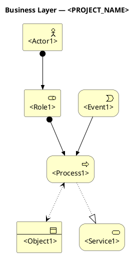

# Business Layer (BL) — ArchiMate 3.2

> **Важно:** этот файл в `.requirements/**` — **шаблон** (read-only).
> Заполненная версия хранится в: `docs/requirements/архитектура/описание BL.md`.

---

## ЗАВИСИМОСТЬ: Каталог сущностей

**Перед заполнением этого документа ОБЯЗАТЕЛЬНО должен существовать:**

```
docs/requirements/архитектура/сущности.md
```

Каталог сущностей содержит типизированные ID сущностей по схеме `<PREFIX>-<NNN>`.
В сценариях BL ссылки указываются по ID из каталога:

```
**Объекты:**
- BO-001: User Account Profile
- BO-002: Apartment Config
- BO-003: Audit Log

**Актёры:**
- BA-001: Customer
- BA-002: Operator

**Процессы:**
- BP-001: User Registration
- BP-002: Order Processing
```

**Если каталог сущностей не создан** — сначала выполни шаблон:
`.requirements/архитектура/сущности архитекутры.md`

---

Подсказка какие есть названия сущностей в языке archimate: 

Бизнес слой - Business Actor,Business Role, Business Collaboration, Business Interface, Business Process, Business Function, Business Interaction, Business Event, Business Service, Business Object, Contract, Representation, Product. 

Прикладной слой - Application Component, Application Collaboration, Application Interface, Application Function, Application Interaction, Application Process, Application Event, Application Service, Data Object. 

Технологический слой - Node, Device, System Software, Technology Collaboration, Technology Interface, Technology Function, Technology Process, Technology Interaction, Technology Event, Technology Service, Artifact, Communication Network, Path. 

Связи - Composition, Aggregation, Assignment, Realization, Specialization, Serving, Access, Influence, Association, Triggering, Flow. 

Коротко: пометка “(опционально)” значит, что элемент не обязателен для базового сквозного сценария (витрина → корзина → заказ → оплата → доставка/трекинг → администрирование) и может не попадать в основную диаграмму. Его добавляем только если это входит в текущий объём проекта. 
Квадратные скобки показывают **участников взаимодействия**.

**Формат:** `[A + B]` — A и B участвуют вместе; знак “+” = совместно, **без направления**.
**Пример:** Оформление заказа `[Покупатель + Витрина]`.

Стили связей:

В ArchiMate оба варианта допустимы:
— Serving: провайдер → потребитель (стрелки «вверх»: Technology → Application → Business).
— Used-by: потребитель → провайдер (стрелки «вниз»: Business → Application → Technology).

Главное — консистентность и корректный тип связи.

Плюс есть «реализация/развёртывание», у которых направление фиксировано:
— Realization: более конкретное → более абстрактное (например, Artifact → Application Component; Data Object → Business Object).
— Deployment: Artifact → Node.
— Triggering: причина → следствие (события/процессы).

---

# ЧАСТЬ 1: ОПИСАТЕЛЬНАЯ (правила, источники, запреты)

---

## 1.1 Назначение документа

Business Layer описывает **ЧТО** делает система с точки зрения бизнеса:
- Кто участвует (акторы, роли)
- Какие процессы выполняются
- Какие события происходят
- Какие бизнес-объекты затрагиваются
- Какие бизнес-сервисы предоставляются

**Business Layer НЕ описывает:**
- Как это реализовано (Application Layer)
- На чём это работает (Technology Layer)
- Какие API, протоколы, базы данных используются

---

## 1.2 Стандарт: ArchiMate 3.2 — Business Layer

Документ оформляется в соответствии со стандартом **ArchiMate 3.2**.

### Сущности Business Layer (полный перечень)

#### Active Structure Elements (кто действует)

| Элемент | ArchiMate | Описание | Когда использовать |
|---------|-----------|----------|-------------------|
| **Business Actor** | `Business_Actor` | Внешний участник (человек, организация) | Пользователь, клиент, партнёр, регулятор |
| **Business Role** | `Business_Role` | Роль, которую может исполнять актор | Администратор, оператор, менеджер |
| **Business Collaboration** | `Business_Collaboration` | Группа ролей, работающих совместно | Команда поддержки, комиссия |
| **Business Interface** | `Business_Interface` | Точка взаимодействия с бизнес-сервисом | Канал обращения, точка контакта |

#### Behavior Elements (что происходит)

| Элемент | ArchiMate | Описание | Когда использовать |
|---------|-----------|----------|-------------------|
| **Business Process** | `Business_Process` | Последовательность действий для результата | Оформление заказа, регистрация |
| **Business Function** | `Business_Function` | Группа действий по бизнес-критерию | Управление клиентами, финансы |
| **Business Interaction** | `Business_Interaction` | Совместное действие нескольких ролей | Согласование, переговоры |
| **Business Event** | `Business_Event` | Событие, влияющее на поведение | Поступление заявки, срабатывание алерта |
| **Business Service** | `Business_Service` | Ценность, предоставляемая внешнему потребителю | Услуга доставки, сервис уведомлений |

#### Passive Structure Elements (с чем работают)

| Элемент | ArchiMate | Описание | Когда использовать |
|---------|-----------|----------|-------------------|
| **Business Object** | `Business_Object` | Информация, с которой работает бизнес | Заказ, клиент, договор, отчёт |
| **Contract** | `Contract` | Формальное соглашение между сторонами | SLA, договор, регламент |
| **Representation** | `Representation` | Форма представления информации | Документ, отчёт, уведомление |
| **Product** | `Product` | Связка сервисов для внешнего потребителя | Тарифный план, пакет услуг |

#### Motivation Elements (зачем)

| Элемент | ArchiMate | Описание | Когда использовать |
|---------|-----------|----------|-------------------|
| **Stakeholder** | `Stakeholder` | Заинтересованная сторона | Владелец, инвестор, регулятор |
| **Driver** | `Driver` | Внешний фактор, влияющий на организацию | Законодательство, конкуренция |
| **Goal** | `Goal` | Желаемый результат | Увеличить конверсию, снизить время |
| **Outcome** | `Outcome` | Измеримый результат | Рост выручки на 10% |
| **Value** | `Value` | Ценность для стейкхолдера | Удобство, экономия, безопасность |

---

## 1.3 Источники для заполнения

| Приоритет | Документ | Путь | Что извлекать |
|-----------|----------|------|---------------|
| **0** | **Каталог сущностей** | **`docs/requirements/архитектура/сущности.md`** | **Object N — номера для ссылок** |
| 1 | Предметная область | `docs/requirements/предметная область.md` | Акторы, глоссарий, бизнес-контекст |
| 2 | Реестр доменов | `docs/requirements/домены/реестр.md` | Список доменов, границы |
| 3 | Карточки доменов | `docs/requirements/домены/<domain>.md` | Scope, actors, owned_data |
| 4 | Карта процесса | `docs/requirements/сценарии/<domain>/карта процесса.md` | Business Process, Business Function |
| 5 | Каталог мероприятий | `docs/requirements/сценарии/<domain>/каталог мероприятий.md` | Business Event (триггеры) |
| 6 | Ограниченные контексты | `docs/requirements/сценарии/<domain>/ограниченные контексты.md` | Business Collaboration, границы |
| 7 | Требования | `docs/requirements/требования/**` | Goal, Outcome, Contract (SLA) |
| 8 | Структура данных | `docs/requirements/структура Данных/описание БД.md` | Business Object (Object ID) |

---

## 1.4 Алгоритм заполнения

### Шаг 0: Проверить каталог сущностей
- Убедиться, что существует `docs/requirements/архитектура/сущности.md`
- Если не существует — сначала создать по шаблону `.requirements/архитектура/сущности архитекутры.md`
- Запомнить нумерацию Business Objects (Object 1, Object 2, ... Object N)

### Шаг 1: Идентифицировать Active Structure
- Выписать всех **Business Actor** из предметной области
- Определить **Business Role** для каждого актора
- Выявить **Business Collaboration** (группы ролей)

### Шаг 2: Описать Behavior
- Для каждого домена извлечь **Business Process** из карты процесса
- Определить **Business Event** из каталога мероприятий (триггеры)
- Сформулировать **Business Service** (что система даёт пользователю)

### Шаг 3: Определить Passive Structure
- Связать **Business Object** с Object ID из структуры данных
- Выявить **Contract** (SLA, регламенты) из требований

### Шаг 4: Зафиксировать Motivation
- Определить **Goal** для каждого процесса
- Сформулировать **Value** для стейкхолдеров

### Шаг 5: Оценить готовность
- Проверить покрытие всех доменов
- Убедиться в отсутствии AL/TL терминов

---

## 1.5 Правила и запреты

### Язык описания

**Шаги процесса описываются в терминах бизнес-намерений и бизнес-результатов.**

| Правильно (BL) | Неправильно (AL/TL) |
|----------------|---------------------|
| Пользователь аутентифицируется | Auth Service проверяет credentials |
| Система сохраняет данные | INSERT в PostgreSQL |
| Пользователь получает уведомление | Push notification через Firebase |
| Система проверяет права доступа | JWT token validation |
| Данные передаются партнёру | REST API POST /endpoint |

### Запреты в Business Layer

```
В документе BL ЗАПРЕЩЕНО:

1. Технологические термины
   - Названия технологий (JWT, Redis, Kafka, PostgreSQL)
   - Протоколы (REST, gRPC, MQTT, WebSocket)
   - Форматы (JSON, XML, Protobuf)

2. Реализационные детали
   - Названия сервисов (Auth Service, API Gateway)
   - Endpoints (POST /api/users)
   - Storage (sessionStorage, localStorage, cache)

3. Инфраструктурные параметры
   - TTL, timeout в секундах (кроме бизнес-SLA)
   - Retry policies (3x30s)
   - Connection pools, replicas

4. Код и псевдокод
   - SQL-запросы
   - Условия в коде (if/else)
   - Регулярные выражения
```

### RLS — только бизнес-уровень

```
RLS в BL описывает:
- КТО может видеть/изменять (роль)
- ЧТО может видеть/изменять (scope)
- ПОЧЕМУ (бизнес-правило)

RLS в BL НЕ описывает:
- SQL-фильтры (WHERE tenant_id = ?)
- Механизм реализации (RBAC/ABAC/ACL)
- Технические политики (row-level policies PostgreSQL)
```

### SLA — только бизнес-ожидания

```
SLA в BL описывает:
- Бизнес-критичность (severity: критично / важно / информационно)
- Ожидаемое время реакции (для пользователя)
- Доступность сервиса (для бизнеса)

SLA в BL НЕ описывает:
- Retry policies
- Circuit breakers
- Технические таймауты
```

---

## 1.6 Типы сценариев (обязательно указывать)

| Тип | Описание | Триггер | Пример |
|-----|----------|---------|--------|
| **Use Case** | Взаимодействие актора с системой для достижения цели | Действие пользователя | Регистрация, оформление заказа |
| **Event-driven Process** | Реакция системы на событие | Business Event | Обработка алерта, уведомление |
| **Policy Enforcement** | Применение бизнес-правила | Условие | Блокировка при превышении лимита |
| **Scheduled Process** | Регулярный процесс по расписанию | Время | Формирование отчёта, обслуживание |
| **Collaboration** | Совместная работа нескольких ролей | Запрос согласования | Утверждение документа |

---

## 1.7 Критерии оценки готовности

| Критерий | Вопрос | Вес |
|----------|--------|-----|
| Полнота акторов | Все Business Actor из предметной области присутствуют? | 15% |
| Полнота процессов | Все домены покрыты Business Process? | 20% |
| Связь с событиями | Каждый процесс имеет триггер (Business Event)? | 10% |
| Business Object | Все объекты связаны с Object ID из структуры БД? | 15% |
| RLS coverage | Для каждого процесса определён scope доступа? | 10% |
| SLA coverage | Для каждого процесса указана критичность? | 10% |
| Чистота BL | Отсутствуют AL/TL термины? | 15% |
| Lifecycle | Stateful объекты имеют описание состояний? | 5% |

**Порог готовности:** ≥80% → готов к AL

---

# ЧАСТЬ 2: ОБЯЗАТЕЛЬНЫЕ РАЗДЕЛЫ ПРИ ОФОРМЛЕНИИ

---

## 2.0 Контекст документа

```markdown
## 0. Контекст документа

- **Проект / продукт:** `<PROJECT_NAME>`
- **Версия:** `<X.Y>`
- **Дата:** `<YYYY-MM-DD>`
- **Стандарт:** ArchiMate 3.2 — Business Layer
- **Владелец:** `<team/person>`

### Источники (статус прочтения)

| Документ | Путь | Статус |
|----------|------|--------|
| Предметная область | `docs/requirements/предметная область.md` | `<read/not found>` |
| Реестр доменов | `docs/requirements/домены/реестр.md` | `<read/not found>` |
| ... | ... | ... |
```

---

## 2.1 Business Actors & Roles

```markdown
## 1. Business Actors & Roles

### 1.1 Business Actors

| ID | Actor | Описание | Внешний/Внутренний |
|----|-------|----------|-------------------|
| BA-01 | `<name>` | `<description>` | `<external/internal>` |

### 1.2 Business Roles

| ID | Role | Исполняется Actor | Scope | Описание |
|----|------|-------------------|-------|----------|
| BR-01 | `<name>` | BA-01 | `<scope>` | `<description>` |

### 1.3 Business Collaborations (если есть)

| ID | Collaboration | Участники (Roles) | Цель |
|----|---------------|-------------------|------|
| BC-01 | `<name>` | BR-01, BR-02 | `<goal>` |
```

**Пример:**

| ID | Actor | Описание | Внешний/Внутренний |
|----|-------|----------|-------------------|
| BA-01 | Клиент | Конечный пользователь системы | external |
| BA-02 | Оператор | Сотрудник службы поддержки | internal |
| BA-03 | Партнёр | Внешняя организация-интегратор | external |

---

## 2.2 Business Objects

```markdown
## 2. Business Objects

| ID | Object | Домен | Описание | Object ID (из БД) |
|----|--------|-------|----------|-------------------|
| BO-01 | `<name>` | `<domain>` | `<description>` | Object N |

### Связи между объектами (если есть)

| Объект A | Связь | Объект B | Описание |
|----------|-------|----------|----------|
| BO-01 | владеет | BO-02 | `<description>` |
```

**Пример:**

| ID | Object | Домен | Описание | Object ID (из БД) |
|----|--------|-------|----------|-------------------|
| BO-01 | Заказ | Orders | Оформленный заказ клиента | Object 15 |
| BO-02 | Позиция заказа | Orders | Товар в заказе | Object 16 |
| BO-03 | Уведомление | Notifications | Сообщение для пользователя | Object 28 |

---

## 2.3 Business Events

```markdown
## 3. Business Events

| ID | Event | Домен | Триггер | Инициатор | Затрагивает |
|----|-------|-------|---------|-----------|-------------|
| BE-01 | `<name>` | `<domain>` | `<what triggers>` | `<actor/system>` | `<objects/processes>` |
```

**Пример:**

| ID | Event | Домен | Триггер | Инициатор | Затрагивает |
|----|-------|-------|---------|-----------|-------------|
| BE-01 | Заказ оформлен | Orders | Клиент подтвердил заказ | BA-01 (Клиент) | BO-01, BP-03 |
| BE-02 | Превышен лимит | Limits | Значение > порога | System | BP-07 |
| BE-03 | Срок истёк | Scheduling | Время наступило | System | BP-12 |

---

## 2.4 Business Processes (сценарии)

```markdown
## 4. Business Processes

### Домен: `<domain_name>`

---

#### BP-01. `<Название процесса>`

**Тип:** `<Use Case / Event-driven / Policy Enforcement / Scheduled / Collaboration>`

**Участники:**
- `<BR-XX>` — `<роль в процессе>`
- `<BR-YY>` — `<роль в процессе>`

**Триггер:** `<BE-XX: название события>` или `<действие актора>`

**Предусловия:**
- `<condition 1>`
- `<condition 2>`

**Шаги:**
1. `<Role>` выполняет `<бизнес-действие>`
2. Система проверяет `<бизнес-правило>`
3. Система создаёт/обновляет `<BO-XX: название>`
4. `<Role>` получает `<бизнес-результат>`

**Постусловия:**
- `<result 1>`
- `<result 2>`

**Business Objects:**
- `<BO-XX>` — `<create/read/update/delete>`

**RLS (бизнес-уровень):**
- `<Role>`: видит `<scope>` (бизнес-правило: `<почему>`)

**SLA (бизнес-ожидания):**
- Критичность: `<критично / важно / информационно>`
- Ожидаемое время: `<для пользователя>`
- Доступность: `<для бизнеса>`

**Value:** `<Для кого>` получает `<какую ценность>` потому что `<бизнес-результат>`

**Статус:** `<Утверждён / Опционален / В разработке>`

---
```

**Пример:**

#### BP-01. Регистрация нового клиента

**Тип:** Use Case

**Участники:**
- BR-01 (Клиент) — инициатор
- BR-02 (Оператор) — подтверждает при необходимости

**Триггер:** Клиент хочет получить доступ к системе

**Предусловия:**
- Клиент не зарегистрирован
- Клиент имеет действующий email

**Шаги:**
1. Клиент предоставляет регистрационные данные
2. Система проверяет уникальность идентификатора
3. Система создаёт учётную запись (BO-04)
4. Система отправляет подтверждение (BO-03)
5. Клиент подтверждает регистрацию
6. Система активирует учётную запись

**Постусловия:**
- Учётная запись создана и активна
- Клиент может аутентифицироваться

**Business Objects:**
- BO-04 (Учётная запись) — create
- BO-03 (Уведомление) — create

**RLS:**
- Клиент: видит только свою учётную запись (владелец данных)
- Оператор: видит все учётные записи (служебная необходимость)

**SLA:**
- Критичность: важно
- Ожидаемое время: регистрация завершается за один сеанс
- Доступность: сервис доступен в рабочие часы

**Value:** Клиент получает доступ к сервисам системы, что позволяет использовать функционал

**Статус:** Утверждён

---

## 2.5 Business Services

```markdown
## 5. Business Services

| ID | Service | Описание | Предоставляется для | Реализуется через |
|----|---------|----------|---------------------|-------------------|
| BS-01 | `<name>` | `<description>` | `<actor/role>` | BP-XX, BP-YY |
```

**Пример:**

| ID | Service | Описание | Предоставляется для | Реализуется через |
|----|---------|----------|---------------------|-------------------|
| BS-01 | Сервис регистрации | Создание учётной записи | BA-01 (Клиент) | BP-01 |
| BS-02 | Сервис уведомлений | Информирование о событиях | BA-01, BA-02 | BP-05, BP-07 |

---

## 2.6 Contracts & SLA

```markdown
## 6. Contracts & SLA

### 6.1 Бизнес-контракты

| ID | Contract | Стороны | Описание |
|----|----------|---------|----------|
| CT-01 | `<name>` | `<parties>` | `<description>` |

### 6.2 SLA по категориям процессов

| Категория | Критичность | Ожидаемое время | Доступность |
|-----------|-------------|-----------------|-------------|
| Аутентификация | Критично | Мгновенно | Всегда |
| Работа с данными | Важно | В течение сеанса | Рабочие часы |
| Уведомления | Информационно | В течение дня | Рабочие часы |
| Отчёты | Информационно | По запросу | Рабочие часы |
```

---

## 2.7 Lifecycle (для stateful объектов)

```markdown
## 7. Lifecycle

### 7.1 `<Business Object>` Lifecycle

**Объект:** BO-XX

**Состояния:**

| State | Описание | Входы | Выходы |
|-------|----------|-------|--------|
| `<state1>` | `<desc>` | — | → `<state2>` при `<event>` |
| `<state2>` | `<desc>` | ← `<state1>` | → `<state3>` при `<event>` |

**Диаграмма:**
```
<Initial>
  → <State2> (при: <business event>)
  → <State3> (при: <business event>)
  → <Final> (при: <business event>)
```
```

**Пример:**

### 7.1 Заказ (BO-01) Lifecycle

**Состояния:**

| State | Описание | Входы | Выходы |
|-------|----------|-------|--------|
| Черновик | Заказ создан, не подтверждён | — | → Оформлен |
| Оформлен | Клиент подтвердил | ← Черновик | → В работе, → Отменён |
| В работе | Исполняется | ← Оформлен | → Выполнен, → Отменён |
| Выполнен | Успешно завершён | ← В работе | — |
| Отменён | Прекращён | ← Оформлен, В работе | — |

---

## 2.8 Итоговая таблица

```markdown
## 8. Итоговая таблица процессов

| ID | Процесс | Домен | Тип | Участники | RLS Scope | SLA | Статус |
|----|---------|-------|-----|-----------|-----------|-----|--------|
| BP-01 | `<name>` | `<domain>` | `<type>` | `<roles>` | `<scope>` | `<severity>` | `<status>` |
```

---

## 2.9 Итоговая оценка

```markdown
## 9. Итоговая оценка

| Критерий | Оценка | Комментарий |
|----------|--------|-------------|
| Полнота акторов | `/10` | `<comment>` |
| Полнота процессов | `/10` | `<comment>` |
| Business Objects | `/10` | `<comment>` |
| RLS coverage | `/10` | `<comment>` |
| SLA coverage | `/10` | `<comment>` |
| Чистота BL (без AL/TL) | `/10` | `<comment>` |
| Lifecycle coverage | `/10` | `<comment>` |
| **OVERALL** | **X.X/10** | |

**Готовность:**
- [ ] ≥8.0 — **READY FOR AL PHASE**
- [ ] 6.0-7.9 — Требуется доработка
- [ ] <6.0 — Существенная переработка
```

---

## 2.10 Приложение: PlantUML (ArchiMate)

```markdown
## 10. Приложение: PlantUML диаграмма


```

---

**Последнее обновление:** `<YYYY-MM-DD>`
