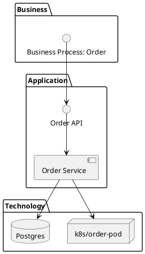

# Сущности архитектуры «<PROJECT_NAME>» (ArchiMate 3.2)

<!--
> **Важно:** этот файл в `.requirements/**` — **шаблон/методика** (read-only).  
> **Фактический реестр архитектурных сущностей проекта** ведётся в: `docs/requirements/архитектура/сущности_archimate.md`.  
> Результаты (заполненные сущности, матрицы, покрытия) сохраняются **только** в `docs/**`.
Назначение: единый реестр архитектурных сущностей для последующего построения ArchiMate-диаграмм
(Business/Application/Technology) и трассировки к требованиям/сценариям/стеку.

Источники фактов для заполнения (обязательные, документы проекта):
- Стек: `docs/requirements/структураПО/стек проекта.md`
- Требования: `docs/requirements/требования/**` (ГОСТ 19/34 — по проекту)
- Сценарии (результаты): `docs/requirements/сценарии/**`

Методики (как делать, read-only):
- Домены: `.requirements/домены/определение доменов.md`
- Сценарии: `.requirements/сценарии/правила.md`

Правила:
1) Сущности должны покрывать сценарии (use cases) и требования (FR/NFR).
2) На каждую сущность: краткое назначение + обязательность (MUST/SHOULD/OPTIONAL) + ссылки на источники (docs/* или ID).
3) Нумерация сквозная внутри каждого слоя и типа (как в примере).
4) Использовать единый словарь имён: <DomainTerm> для бизнес-объектов, <ServiceName> для сервисов.
5) Опциональные сущности помечать *(опц.)* и объяснять “когда нужны”.
6) Если есть микросервисы/модули — Application Component = сервис/модуль, Application Service = его публичная capability. -->

---

## 0. Контекст
- **Проект:** `<PROJECT_NAME>`
- **Версия документа:** `<vX.Y>`
- **Дата:** `<YYYY-MM-DD>`
- **Ответственный:** `<team/person>`

### 0.1 Ссылки на источники (факты проекта)
- **Стек:** `docs/requirements/структураПО/стек проекта.md`
- **Требования:** `docs/requirements/требования/**`
- **Сценарии:** `docs/requirements/сценарии/**`

---

## 1. Карта покрытия (traceability)
> Коротко: какие сценарии и требования покрываем этим реестром.

- **SC-01:** `<scenario-name>` → `<ключевые BC/компоненты>`
- **SC-02:** `<scenario-name>` → `<...>`
- **FR/NFR (из требований):** `<IDs/кратко>` → `<сущности>`

---

# Бизнес-слой (Business Layer)

## Business Actor
> Реальные участники (люди/организации), взаимодействующие с системой.

1. `<ActorName1>` — `<кто это>` *(MUST/SHOULD/OPTIONAL)* — источники: `<SC-xx / FR-xx / docs/*>`
2. `<ActorName2>` — `<...>`
3. **`<OptionalActor>` *(опц.)*** — `<когда нужен>` — источники: `<...>`

## Business Role
> Роли в домене (обязанности/полномочия), не конкретные люди.

4. `<RoleName1>` — `<ответственность>` *(MUST/SHOULD/OPTIONAL)* — источники: `<SC-xx / FR-xx / docs/*>`
5. `<RoleName2>` — `<...>`
6. **`<OptionalRole>` *(опц.)*** — `<когда нужен>` — источники: `<...>`

## Business Process
> Процессы “с точки зрения бизнеса” (цепочки действий и результатов).

7. `<ProcessName1>` — `<результат процесса>` *(MUST/SHOULD/OPTIONAL)*  
   - Триггер: `<actor/condition>`  
   - Выход: `<business outcome>`  
   - Источники: `<SC-xx, FR-xx, docs/*>`
8. `<ProcessName2>` — `<...>`
9. **`<OptionalProcess>` *(опц.)*** — `<когда нужен>` — источники: `<...>`

## Business Function
> Функции — устойчивые способности бизнеса (набор процессов/задач).

10. `<FunctionName1>` — `<что обеспечивает>` *(MUST/SHOULD/OPTIONAL)* — источники: `<FR/NFR, docs/*>`
11. `<FunctionName2>` — `<...>`
12. **`<OptionalFunction>` *(опц.)*** — `<когда нужен>` — источники: `<...>`

## Business Service
> Ценности, предоставляемые бизнесу/пользователю.

13. Сервис «`<BusinessService1>`» — `<ценность>` *(MUST/SHOULD/OPTIONAL)* — источники: `<FR/NFR, SC-xx, docs/*>`
14. Сервис «`<BusinessService2>`» — `<...>`
15. **Сервис «`<OptionalBusinessService>`» *(опц.)*** — `<когда нужен>` — источники: `<...>`

## Business Object
> Доменные объекты/артефакты, понятные бизнесу (не обязательно данные БД).

16. `<BusinessObject1>` — `<описание>` *(MUST/SHOULD/OPTIONAL)* — источники: `<SC-xx / FR-xx / docs/*>`
17. `<BusinessObject2>` — `<...>`
18. **`<OptionalBusinessObject>` *(опц.)*** — `<когда нужен>` — источники: `<...>`

---

# Прикладной слой (Application Layer)

## Application Component
> Исполняемые компоненты ПО: сервисы, модули, приложения, jobs, gateway, UI.

1. `<ComponentName1>` (`<lang/stack>`) — `<назначение>` *(MUST/SHOULD/OPTIONAL)*  
   - Границы ответственности: `<what it owns>`  
   - Источники: `<стек: docs/requirements/структураПО/стек проекта.md; SC-xx; FR-xx>`
2. `<ComponentName2>` (`<...>`) — `<...>`
3. **`<OptionalComponent>` *(опц.)*** — `<когда нужен>` — источники: `<...>`

## Application Service
> Публичные прикладные способности, которые компоненты предоставляют (capabilities).

4. `<AppServiceName1>` — предоставляется: `<ComponentName1>` *(MUST/SHOULD/OPTIONAL)*  
   - Описание: `<что делает>`  
   - Основные операции: `<create/read/update/execute>`  
   - Сценарии: `<SC-xx>`  
   - Требования: `<FR/NFR IDs>`
5. `<AppServiceName2>` — `<...>`
6. **`<OptionalAppService>` *(опц.)*** — `<когда нужен>` — источники: `<...>`

## Application Interface
> Внешние интерфейсы: API, UI, webhooks, очереди, файлы, CLI.

7. `<InterfaceName1>` — тип: `<REST/gRPC/GraphQL/WebSocket/CLI/Event>` *(MUST/SHOULD/OPTIONAL)*  
   - Протокол/формат: `<HTTP+JSON/Protobuf/...>`  
   - Аутентификация: `<...>`  
   - Источники: `<стек; требования>`
8. `<InterfaceName2>` — `<...>`
9. **`<OptionalInterface>` *(опц.)*** — `<когда нужен>` — источники: `<...>`

## Application Data Object
> Прикладные структуры данных: DTO, события, проекции, записи.

10. `<DataObject1>` — владелец: `<BC/Component>` *(MUST/SHOULD/OPTIONAL)*  
    - Ключевые поля: `<id, status, timestamps...>`  
    - Связанные события: `<EVT names>`  
    - Источники: `<docs/requirements/сценарии/**; требования>`
11. `<DataObject2>` — `<...>`
12. **`<OptionalDataObject>` *(опц.)*** — `<когда нужен>` — источники: `<...>`

---

# Технологический слой (Technology Layer)

## Node / Device
> Узлы размещения: VM/сервер/контейнер/edge-устройство/кластер.

1. `<NodeName1>` — `<тип: VM/physical/k8s node/edge>` *(MUST/SHOULD/OPTIONAL)*  
   - ОС: `<...>`  
   - Ресурсы: `<cpu/ram/disk>`  
   - Размещение: `<cloud/on-prem>`  
   - Источники: `<стек: docs/requirements/структураПО/стек проекта.md>`
2. `<NodeName2>` — `<...>`
3. **`<OptionalNode>` *(опц.)*** — `<когда нужен>` — источники: `<...>`

## System Software
> Платформы и системное ПО: OS, runtime, контейнеры, БД, брокеры, прокси.

4. `<Software1>` — `<роль>` *(MUST/SHOULD/OPTIONAL)* — версия: `<min/rec>` — источники: `<стек>`
5. `<Software2>` — `<...>`
6. **`<OptionalSoftware>` *(опц.)*** — `<когда нужен>` — источники: `<...>`

## Technology Interface
> Технические интерфейсы: порты, протоколы, каналы связи, storage API.

7. `<TechInterface1>` — `<protocol/port>` *(MUST/SHOULD/OPTIONAL)*  
   - Шифрование: `<TLS/mTLS/VPN>`  
   - Источники: `<требования; стек>`
8. `<TechInterface2>` — `<...>`
9. **`<OptionalTechInterface>` *(опц.)*** — `<когда нужен>` — источники: `<...>`

## Technology Service
> Технологические сервисы платформы: БД, брокер, мониторинг, бэкакапы, CDN.

10. `<TechService1>` — `<value>` *(MUST/SHOULD/OPTIONAL)* — реализуется: `<Software/Node>`  
    - SLO: `<availability/latency>`  
    - Источники: `<требования; стек>`
11. `<TechService2>` — `<...>`
12. **`<OptionalTechService>` *(опц.)*** — `<когда нужен>` — источники: `<...>`

## Technology Process
> Технологические процессы эксплуатации: деплой, бэкапы, миграции, ротация секретов.

13. `<TechProcess1>` — `<что делаем>` *(MUST/SHOULD/OPTIONAL)*  
    - Триггер: `<schedule/event>`  
    - Инструменты: `<CI/CD, scripts>`  
    - Источники: `<требования; стек>`
14. `<TechProcess2>` — `<...>`
15. **`<OptionalTechProcess>` *(опц.)*** — `<когда нужен>` — источники: `<...>`

---

# 2. Bounded Context (опционально, но рекомендуется)
> Если проект использует DDD/микросервисы: перечисли BC и их ответственность.

## BC List
- **BC-01 `<BCName>`:** `<responsibility>` — владельцы данных: `<entities>` — источники: `<docs/requirements/сценарии/**; docs/requirements/домены/**>`
- **BC-02 `<BCName>`:** `<...>`

---

# 3. Матрица трассировки (обязательная для качества)

## 3.1 Требования → Сущности
| Requirement ID | Кратко | Сущности (Business/App/Tech) | Комментарий |
|---|---|---|---|
| `<FR-01>` | `<...>` | `<IDs: 7, 13, 1, 10...>` | `<...>` |
| `<NFR-01>` | `<...>` | `<...>` | `<...>` |

## 3.2 Сценарии → Сущности
| Scenario ID | Сценарий | Сущности | Комментарий |
|---|---|---|---|
| `<SC-01>` | `<...>` | `<...>` | `<...>` |
| `<SC-02>` | `<...>` | `<...>` | `<...>` |

---

# 4. Итог
- **Обязательные сущности (MUST):** `<short list>`
- **Опциональные (OPTIONAL):** `<short list + conditions>`
- **Открытые вопросы:**
  - [ ] `<question 1>`
  - [ ] `<question 2>`

---

# 5. Приложение: заготовка для ArchiMate-диаграмм (опционально)

## 5.1 Подсказка по мэппингу (Event Storming → Архитектура)
Кратко: разработка начинается со сценарных артефактов (см. `docs/requirements/сценарии/**`). Методика формирования сценариев описана в `.requirements/сценарии/правила.md`. Сформированные сценарии и доменные события затем переводим в архитектурные сущности (Business → Application → Technology) для трассировки требований и построения ArchiMate-диаграмм.

Правила мэппинга:
- Event (Domain Event) → Business Process / Business Event (изменение состояния, триггер процесса)
- Command → Application Service / Operation (инициирует действие в приложении)
- Aggregate / Entity → Application Data Object (модель, DTO, таблица)
- Read model / Projection → Application Data Object / Read model (проекция для чтения)
- External system / Actor → Technology Service / Node (интеграции и внешние зависимости)
- Application Component → Node / Container (куда разворачивается компонент)

## 5.2 Диаграммы PlantUML пример (если используется)

