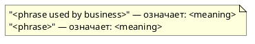
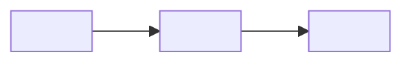

# Предметная область системы <PROJECT_NAME>

<!--
Назначение: описать домен (problem space) так, чтобы:
- команда и агенты одинаково понимали “что мы строим и зачем”,
- термины были однозначны,
- границы ответственности и сценарии были пригодны для Event Storming, требований и тестов.

Шаблон универсален: подходит для продукта, платформы, сервиса, библиотеки/CLI.

Правила:
- Пиши фактами и наблюдаемыми формулировками.
- Разделяй доменную часть (что важно предметной области) и реализацию (как сделано) — реализацию сюда не тащим.
- Для каждого критичного термина: определение + пример + антипример (если важно).

> **Важно:** это **шаблон** (read-only) в `.requirements/**`.
> Заполненная версия документа создаётся и ведётся в: `docs/requirements/предметная область.md`.
> Шаблоны не правим, результаты фиксируем только в `docs/**`.
-->

## 0. Контекст документа

* **Проект / продукт:** `<PROJECT_NAME>`
* **Версия документа:** `<vX.Y>`
* **Дата обновления:** `<YYYY-MM-DD>`
* **Владелец (owner):** `<team/person>`

### 0.1 Входные источники (что уже существует)

* `<регламент / закон / ГОСТ / внутренний стандарт>`
* `<договор / приказ / распоряжение>`
* `<описание текущей системы / AS-IS>`
* `<интервью / протокол встреч / заметки>`
* `<референсные данные / каталоги / справочники>`

### 0.2 Производные документы проекта (создаются ПОСЛЕ этого документа)

> Ниже перечислены **проектные документы** (заполненные артефакты).
> Если по указанному пути лежит только шаблон — это считается **несозданным документом** и его нужно создать отдельно.

* **Обоснование выбора / направление исследований (документ проекта):** `docs/requirements/обоснование выбора.md`
* **Требования (документы проекта):**

  * `docs/requirements/требования/требования_гост19.md` *(если ГОСТ 19)*
  * `docs/requirements/требования/требования_гост34.md` *(если ГОСТ 34)*
* **Event Storming (документы проекта, если применяется):**

  * Карта процесса: `docs/requirements/сценарии/карта процесса.md`
  * Каталог мероприятий: `docs/requirements/сценарии/каталог мероприятий.md`
  * Ограниченные контексты: `docs/requirements/сценарии/ограниченные контексты.md`

### 0.3 Шаблоны (используются для создания документов, НЕ являются проектными артефактами)

> Эти файлы служат **инструкцией/каркасом**. Их не редактируют “по проекту” — из них **копируют** структуру в документы проекта.

* Шаблон обоснования: `.requirements/_templates/обоснование выбора.md`
* Шаблоны требований:

  * `.requirements/_templates/требования_гост19.md`
  * `.requirements/_templates/требования_гост34.md`
* Шаблоны Event Storming:

  * `.requirements/_templates/сценарии/карта процесса.md`
  * `.requirements/_templates/сценарии/каталог мероприятий.md`
  * `.requirements/_templates/сценарии/ограниченные контексты.md`

---

## 1. Расшифровка названия / аббревиатуры (если есть)
**<PROJECT_NAME / ABBR>** = <expansion>

- **<Part 1>** — <meaning>
- **<Part 2>** — <meaning>
- **...**

**Суть (1–2 предложения):** <core statement>

---

## 2. Обзор предметной области

### 2.1 Контекст проблемы (Problem Statement)
**Наблюдение/тенденция:** <what changed in the world/organization>  
**Боль/проблема:** <what is failing or too costly>  
**Почему сейчас:** <why it matters now>  
**Ограничения домена:** <legal/org/process constraints>

### 2.2 Цель системы (Goal)
Система предназначена для:
- <goal 1>
- <goal 2>
- <goal 3>

**Вне цели (Out of Scope):**
- <non-goal 1>
- <non-goal 2>

### 2.3 Критерии успеха (Success Criteria)
- **SC-01:** <measurable result>
- **SC-02:** <measurable result>
- **SC-03:** <measurable result>

---

## 3. Участники домена (Actors / Stakeholders)
> Кто взаимодействует с системой или заинтересован в результатах.

| Роль/актёр | Описание | Цели | Боли/риски | Канал взаимодействия |
|---|---|---|---|---|
| <Actor> | <who> | <why> | <pain> | <UI/API/CLI/integration> |
| <Actor> |  |  |  |  |

---

## 4. Доменная модель (концепции и термины)

### 4.1 Глоссарий (обязательный минимум)
> Если термин важен — он должен быть здесь.

| Термин | Определение | Пример | Антипример/путаница |
|---|---|---|---|
| <Term> | <definition> | <example> | <what it is NOT> |
| <Term> |  |  |  |

### 4.2 Основные сущности (Entities) и их состояние
> Сущности домена, которые имеют жизненный цикл.

#### Entity: <EntityName>
- **Описание:** <what it is>
- **Ключевые атрибуты:** `<id>`, `<status>`, `<timestamps>`, `<owner>`
- **Статусы (state machine):**
  - `<STATE_1>` → <meaning>
  - `<STATE_2>` → <meaning>
- **Переходы (что меняет статус):** <domain actions/events>
- **Инварианты (не должно нарушаться):**
  - <invariant 1>
  - <invariant 2>

> Повтори блок для всех критичных сущностей.

### 4.3 Доменные правила (Business Rules)
> Правила уровня “в мире домена так принято” (а не технические ограничения).

- **BR-01:** <rule>  
  - **Причина:** <why>  
  - **Исключения:** <exceptions>
- **BR-02:** <rule>  
  - **Причина:** <why>  
  - **Исключения:** <exceptions>

---

## 5. Доменные процессы и сценарии (Use Cases)
> Здесь фиксируются “что происходит” в терминах домена. Технические детали — минимально.

### 5.1 Карта сценариев (список)
- **UC-01:** <name> — <goal> — актёр: <actor>
- **UC-02:** <name> — <goal> — актёр: <actor>
- **UC-03:** <name> — <goal> — актёр: <actor>

### 5.2 Шаблон сценария (для каждого UC)
#### UC-<NN>: <Use case name>
- **Цель:** <goal>
- **Актёр:** <actor>
- **Триггер:** <what starts it>
- **Предусловия:** <preconditions>
- **Постусловия:** <postconditions>
- **Основной поток (happy path):**
  1. <step>
  2. <step>
  3. <step>
- **Альтернативы / исключения:**
  - **ALT-1:** <condition> → <outcome>
  - **ALT-2:** <condition> → <outcome>
- **Данные/артефакты домена:** <entities/documents created/changed>
- **Связь с событиями (если есть):** <EventName из event-catalog.md>

---

## 6. Доменная событийность (Domain Events) (кратко, если применимо)
> Если Event Storming ещё не проводился — оставь раздел минимальным (черновик) или пометь как TBD.

- **Ключевые доменные события:**
  - <EventName> — <meaning>
  - <EventName> — <meaning>

**Каталог событий (если создан):** `.requirements/сценарии/event-catalog.md`

---

## 7. Границы домена (Bounded Contexts) (обзор, если применимо)
> Высокоуровневое описание границ ответственности.

- **<BC-01>:** <responsibility>
- **<BC-02>:** <responsibility>
- **<BC-03>:** <responsibility>

**Описание контекстов (если создано):** `.requirements/сценарии/bounded-contexts.md`

---

## 8. Данные и классификация (если применимо)
> Для доменов с документами/PII/секретами/регуляторикой.

### 8.1 Категории данных
| Категория | Примеры | Чувствительность | Требования домена |
|---|---|---|---|
| <Public> | <...> | low | <...> |
| <Internal> | <...> | medium | <...> |
| <Confidential/PII> | <...> | high | <...> |

### 8.2 Политики хранения/обработки (в доменных терминах)
- <retention rule>
- <masking/anonymization rule>
- <access rule>

---

## 9. Метрики и KPI (доменного уровня)
> Метрики “что стало лучше” (не CPU/RAM), отражающие ценность.

- **KPI-01:** <metric> — формула: <how measured> — цель: <target>
- **KPI-02:** <metric> — формула: <how measured> — цель: <target>

---

## 10. Нюансы и особенности (Domain Nuances)
> “Подводные камни” домена, которые важно помнить разработчикам и агентам.

### 10.1 Нюанс: <name>
- **Описание:** <what>
- **Почему важно:** <impact>
- **Типичные ошибки:** <mistakes>
- **Как правильно:** <guidance>

---

## 11. Риски и допущения (Domain Risks & Assumptions)
### 11.1 Допущения
- **A-01:** <assumption>
- **A-02:** <assumption>

### 11.2 Риски
- **R-01:** <risk> → <mitigation>
- **R-02:** <risk> → <mitigation>

---

## 12. Приложения (опционально)

### 12.1 Диаграммы PlantUML пример (если используется)

### 12.2 Диаграммы Mermaid пример (если используется)

### 12.3 Parking Lot (вопросы)

* [ ] <open question 1>
* [ ] <open question 2>
