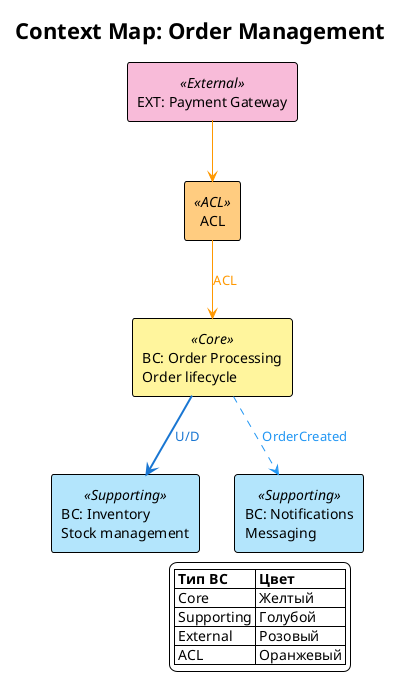
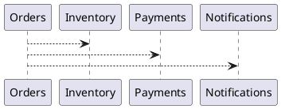
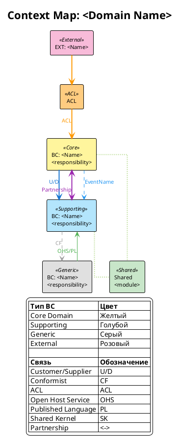
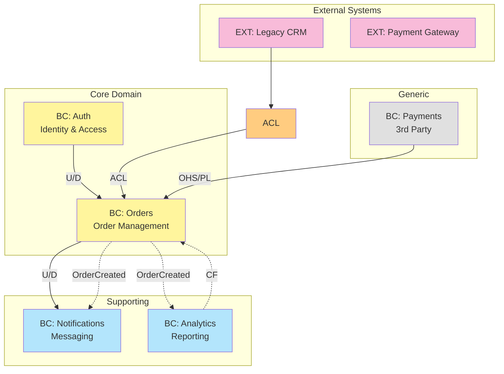
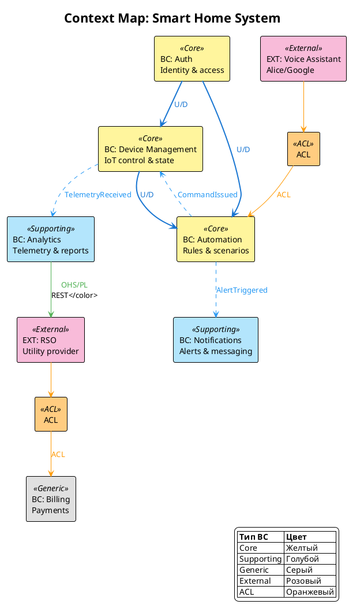

# Создай диаграмму Context Map (H6)

Процедура этапа [5.4] из `.requirements/трек разработки.md`.

> **Важно:** это **методика** (read-only) в `.requirements/**`.
> **Подход:** `.approach/context-map.md` (концептуальная методология Context Map).

---

**Входные данные:**
- `docs/requirements/сценарии/<domain_slug>/ограниченные контексты.md` (этап [5.3])

**Выходные данные:**
- `docs/requirements/сценарии/<domain_slug>/diagrams/context-map.plantuml` (H8)

---

## Примеры заполнения (ОБЯЗАТЕЛЬНО изучить перед созданием)

> **Важно:** Примеры ниже носят иллюстративный характер. Конкретные BC и связи
> должны определяться на основе документа `ограниченные контексты.md` проекта.

### Считать верным: Достаточная детализация Context Map



**Почему верно:**
- BC классифицированы (Core/Supporting/External)
- Типы связей указаны (U/D, ACL, Event Flow)
- Цвета соответствуют типам BC
- Легенда присутствует
- Направление зависимостей указано

### Считать неверным: Недостаточная детализация



**Почему неверно:**
- BC не классифицированы (нет Core/Supporting/Generic)
- Типы связей не указаны (U/D? CF? ACL?)
- Нет цветовой схемы
- Нет легенды
- Нет описания ответственности BC
- Невозможно понять архитектуру интеграций

---

## Минимальные критерии детализации Context Map

| Элемент | Минимум | Как проверить |
|---------|---------|---------------|
| **BC на диаграмме** | Все BC из `ограниченные контексты.md` | Сравнить с разделом 2 |
| **Классификация BC** | Указан тип (Core/Supporting/Generic) | Цвет + <<type>> |
| **Внешние системы** | Все EXT из интеграций | Отдельный цвет (розовый) |
| **ACL** | Показаны где есть legacy интеграции | Оранжевый цвет |
| **Типы связей** | U/D, CF, ACL, OHS для каждой связи | Метка на стрелке |
| **Событийные потоки** | Из Integration Matrix | Пунктирные стрелки с именем события |
| **Легенда** | Присутствует | Внизу или справа диаграммы |
| **Рендеринг** | Без ошибок | Проверить через PlantUML/Kroki |

---

## Правила извлечения данных для Context Map

| Откуда | Что извлекать | Куда |
|--------|---------------|------|
| Ограниченные контексты, раздел 2 | Список BC с ответственностями | `component` элементы |
| Ограниченные контексты, раздел 2 | Тип BC (Core/Supporting/Generic) | `<<type>>` стереотип |
| Ограниченные контексты, раздел 3 | Context Map связи | Стрелки с типами (U/D, CF, ACL) |
| Ограниченные контексты, раздел 3.1 | ACL | `component` с `<<ACL>>` |
| Ограниченные контексты, раздел 4 | Integration Matrix | Пунктирные стрелки (Event Flow) |
| Карточка домена, `interfaces` | Внешние системы | `component` с `<<External>>` |

---

## 1. Когда строить Context Map

**Предусловия:**
- Этап [5.3] Ограниченные контексты завершен
- Выделены Bounded Contexts (BC) с ответственностями
- Определены интеграции между BC (события, API)

**Результат:**
- `docs/requirements/сценарии/<domain>/diagrams/context-map.plantuml`
- Опционально: отдельные диаграммы для подсистем

---

## 2. Типы связей Context Map (DDD)

| Тип связи | Направление | Описание | Когда использовать |
|-----------|-------------|----------|-------------------|
| **Customer/Supplier** | U → D | Upstream поставляет, Downstream потребляет | Зависимость с возможностью влияния |
| **Conformist** | U → D | Downstream принимает модель Upstream без изменений | Нет возможности влиять на поставщика |
| **Anti-Corruption Layer (ACL)** | U → [ACL] → D | Downstream защищается от чужой модели | Интеграция с legacy/внешними системами |
| **Open Host Service (OHS)** | U → D | Upstream предоставляет публичный протокол | API для множества потребителей |
| **Published Language (PL)** | U ↔ D | Общий язык/схема обмена | JSON Schema, Protobuf, AsyncAPI |
| **Shared Kernel** | A ↔ B | Общий код/модель между контекстами | Тесная связь, общая команда |
| **Partnership** | A ↔ B | Взаимозависимые контексты, совместное развитие | Две команды, общие цели |
| **Separate Ways** | A | B | Контексты не интегрируются | Независимые домены |

---

## 3. Цветовая схема

| Элемент | Цвет | HEX | Назначение |
|---------|------|-----|------------|
| **Core Domain BC** | Желтый | `#FFF59D` | Основной бизнес |
| **Supporting BC** | Голубой | `#B3E5FC` | Поддерживающие функции |
| **Generic BC** | Серый | `#E0E0E0` | Типовые/внешние сервисы |
| **External System** | Розовый | `#F8BBD9` | Внешние системы |
| **ACL** | Оранжевый | `#FFCC80` | Anti-Corruption Layer |
| **Shared Kernel** | Зеленый | `#C8E6C9` | Общий код |

### Цвета связей

| Тип связи | Цвет | Стиль |
|-----------|------|-------|
| Customer/Supplier | `#1976D2` | solid, thickness=2 |
| Conformist | `#9E9E9E` | dashed |
| ACL | `#FF9800` | solid, thickness=2 |
| OHS/PL | `#4CAF50` | solid |
| Shared Kernel | `#8BC34A` | dotted, thickness=2 |
| Partnership | `#9C27B0` | solid, bidirectional |
| Event Flow | `#2196F3` | dashed |

---

## 4. Context Map — PlantUML

### 4.1 Шаблон



### 4.2 Формат элементов

```plantuml
' Bounded Context
component "BC: <Name>\n<short responsibility>" as BC_ID <<Type>>

' External System
component "EXT: <Name>" as EXT_ID <<External>>

' ACL
component "ACL\n<what it protects>" as ACL_ID <<ACL>>

' Shared Kernel
component "Shared\n<module name>" as SK_ID <<Shared>>
```

### 4.3 Формат связей

```plantuml
' Customer/Supplier: Upstream -> Downstream
BC_Upstream -[#1976D2,thickness=2]-> BC_Downstream : <color:#1976D2>U/D</color>

' Conformist: принимает модель без изменений
BC_Consumer -[#9E9E9E,dashed]-> BC_Provider : <color:#9E9E9E>CF</color>

' ACL: защита от внешней модели
EXT_Legacy -[#FF9800]-> ACL_Adapter
ACL_Adapter -[#FF9800]-> BC_Internal : <color:#FF9800>ACL</color>

' Open Host Service + Published Language
BC_Provider -[#4CAF50]-> BC_Consumer : <color:#4CAF50>OHS/PL\nREST API</color>

' Shared Kernel: общий код (bidirectional, no arrow)
BC_A -[#8BC34A,dotted,thickness=2]- SharedKernel
BC_B -[#8BC34A,dotted,thickness=2]- SharedKernel

' Partnership: совместное развитие
BC_A <-[#9C27B0,thickness=2]-> BC_B : <color:#9C27B0>Partnership</color>

' Event Flow (async)
BC_Publisher .[#2196F3,dashed].> BC_Subscriber : <color:#2196F3>OrderCreated</color>
```

---

## 5. Context Map — Mermaid

### 5.1 Шаблон



### 5.2 Формат элементов Mermaid

```mermaid
%% Bounded Context
BC1["BC: <Name>\n<responsibility>"]

%% External System
EXT1["EXT: <Name>"]

%% ACL
ACL1["ACL"]

%% Связи
BC1 -->|U/D| BC2           %% Customer/Supplier
BC1 -.->|CF| BC2           %% Conformist
BC1 -->|ACL| BC2           %% через ACL
BC1 -->|OHS/PL| BC2        %% Open Host Service
BC1 -.->|EventName| BC2    %% Event Flow
BC1 <-->|Partnership| BC2  %% Partnership
```

---

## 6. Паттерны интеграции

### 6.1 Customer/Supplier с событиями

```plantuml
component "BC: Orders\n(Upstream)" as Orders <<Core>>
component "BC: Shipping\n(Downstream)" as Shipping <<Supporting>>
component "BC: Billing\n(Downstream)" as Billing <<Supporting>>

Orders .[#2196F3,dashed].> Shipping : <color:#2196F3>OrderPlaced</color>
Orders .[#2196F3,dashed].> Billing : <color:#2196F3>OrderPlaced</color>

note bottom of Orders : Publisher
note bottom of Shipping : Subscriber
note bottom of Billing : Subscriber
```

### 6.2 ACL для Legacy системы

```plantuml
component "EXT: Legacy ERP" as Legacy <<External>>
component "ACL\nERP Adapter" as ACL <<ACL>>
component "BC: Inventory" as Inventory <<Core>>

Legacy -[#FF9800,thickness=2]-> ACL : SOAP/XML
ACL -[#FF9800,thickness=2]-> Inventory : <color:#FF9800>Domain Events</color>

note right of ACL
  Transforms:
  - Legacy Product -> Product
  - Legacy Order -> OrderLine
end note
```

### 6.3 Shared Kernel

```plantuml
component "BC: Auth" as Auth <<Core>>
component "BC: Users" as Users <<Core>>
component "Shared\nIdentity" as Identity <<Shared>>

Auth -[#8BC34A,dotted,thickness=2]- Identity
Users -[#8BC34A,dotted,thickness=2]- Identity

note bottom of Identity
  Shared:
  - UserId value object
  - Permission enum
  - Role entity
end note
```

### 6.4 Open Host Service + Published Language

```plantuml
component "BC: Catalog\n(Provider)" as Catalog <<Core>>
component "BC: Search\n(Consumer)" as Search <<Supporting>>
component "BC: Mobile App\n(Consumer)" as Mobile <<Supporting>>

Catalog -[#4CAF50]-> Search : <color:#4CAF50>OHS: REST API\nPL: OpenAPI 3.0</color>
Catalog -[#4CAF50]-> Mobile : <color:#4CAF50>OHS: GraphQL\nPL: Schema</color>

note right of Catalog
  Published Language:
  - OpenAPI spec
  - JSON Schema
  - AsyncAPI (events)
end note
```

---

## 7. Связь с Integration Matrix

Context Map визуализирует данные из раздела 4 "Integration Matrix" документа `ограниченные контексты.md`:

| Publisher (BC) | Event | Subscribers (BC) | Визуализация |
|----------------|-------|------------------|--------------|
| Orders | OrderPlaced | Shipping, Billing | `Orders .[dashed].> Shipping : OrderPlaced` |
| Orders | OrderCancelled | Shipping, Billing | `Orders .[dashed].> Billing : OrderCancelled` |

---

## 8. Примеры

### 8.1 Smart Home Context Map



---

## 9. Ссылки

- Ограниченные контексты: `.requirements/сценарии/ограниченные контексты.md`
- Определение доменов: `.requirements/домены/определение доменов.md`
- Формат диаграмм: `docs/requirements/обоснование выбора.md`

---

## Критерии готовности этапа [5.4] (Context Map)

### Минимальные (блокируют завершение этапа [5])

- [ ] **BC на диаграмме:** все BC из `ограниченные контексты.md` присутствуют
- [ ] **Классификация:** BC типизированы (Core/Supporting/Generic)
- [ ] **Внешние системы:** все EXT из интеграций показаны
- [ ] **Типы связей:** указаны (U/D, CF, ACL, OHS) для каждой связи
- [ ] **Событийные потоки:** события из Integration Matrix визуализированы
- [ ] **Легенда:** присутствует с расшифровкой цветов и связей
- [ ] **Рендеринг:** диаграмма рендерится без ошибок
- [ ] **H8 создан:** `docs/requirements/сценарии/<domain_slug>/diagrams/context-map.plantuml`

### Рекомендуемые

- [ ] **ACL:** показаны для интеграций с legacy/внешними системами
- [ ] **Направление U/D:** указано Upstream/Downstream
- [ ] **Цветовая схема:** соответствует стандарту (Core=желтый, Supporting=голубой, etc.)
- [ ] **Размер:** не перегружена (max 10-12 BC на диаграмму)

### Проверка соответствия

- [ ] Сравнить с разделом 2 `ограниченные контексты.md` — все BC присутствуют
- [ ] Сравнить с разделом 3 `Context Map` — все связи показаны
- [ ] Сравнить с разделом 4 `Integration Matrix` — события визуализированы
