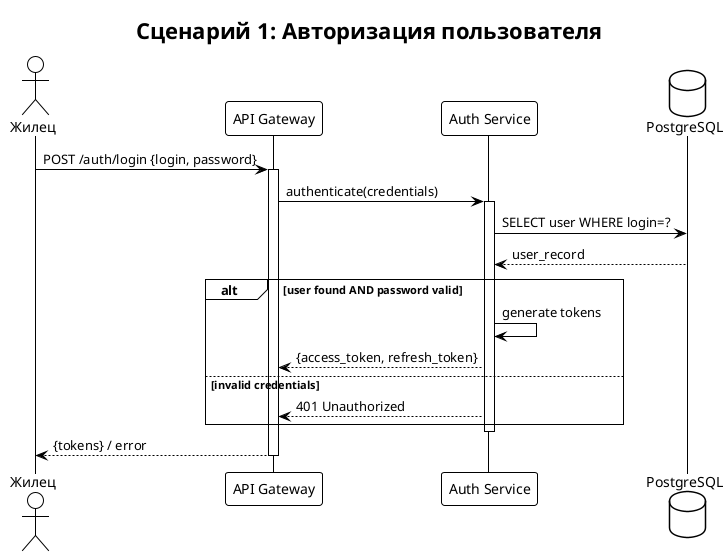
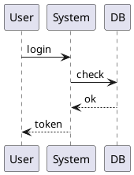
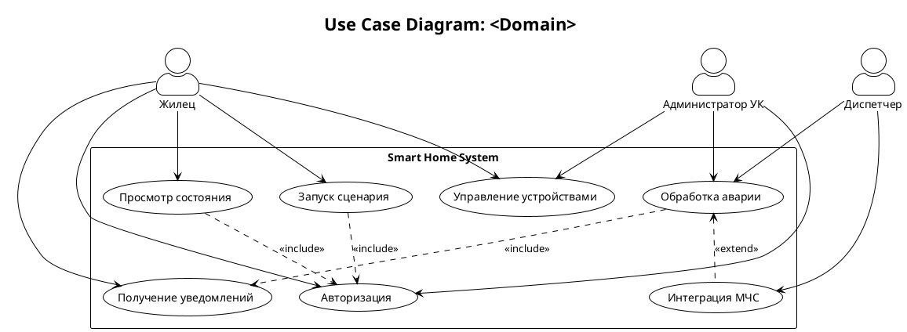
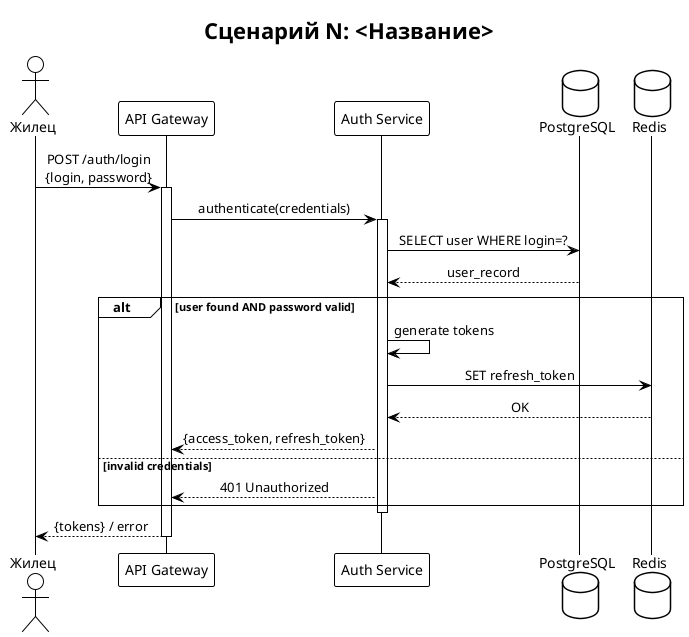
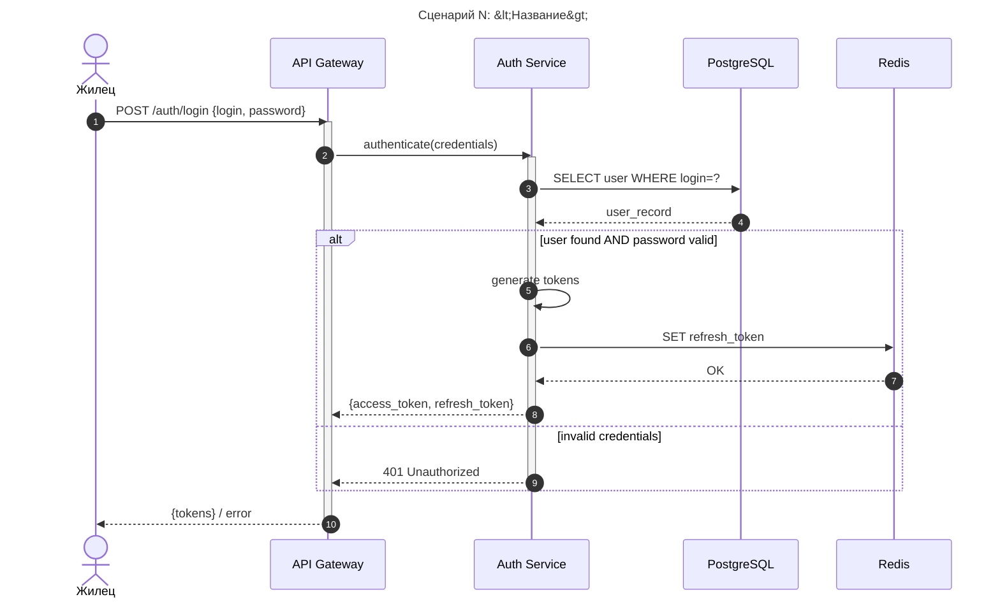

# Создай диаграммы сценариев (H6)

Процедура этапа [5.4] из `.requirements/трек разработки.md`.

> **Важно:** это **методика** (read-only) в `.requirements/**`.

---

**Входные данные:**
- `docs/requirements/сценарии/<domain_slug>/карта процесса.md` (этап [5.1])
- `docs/requirements/обоснование выбора.md` — формат диаграмм (этап [2])

**Выходные данные:**
- `docs/requirements/сценарии/<domain_slug>/diagrams/*.plantuml` (H8)

---

## Примеры заполнения (ОБЯЗАТЕЛЬНО изучить перед созданием)

> **Важно:** Примеры ниже носят иллюстративный характер. Конкретные диаграммы
> должны строиться на основе карты процесса конкретного проекта.

### Считать верным: Достаточная детализация диаграммы



**Почему верно:**
- Указаны все участники с понятными именами
- Есть alt/else для альтернативных потоков
- REST endpoints указаны в сообщениях
- Диаграмма соответствует текстовому описанию из карты процесса

### Считать неверным: Недостаточная детализация



**Почему неверно:**
- Участники не типизированы (actor/participant/database)
- Нет деталей REST endpoint
- Нет альтернативных потоков (что если ошибка?)
- Нет активаций (activate/deactivate)
- Невозможно понять детали процесса

---

## Минимальные критерии детализации диаграмм

| Элемент | Минимум | Как проверить |
|---------|---------|---------------|
| **Участники** | >= 3 (Actor + >= 2 компонента) | Типизированы: actor, participant, database |
| **Сообщения** | >= 5 в последовательности | Стрелки между участниками |
| **REST endpoints** | Указаны для API вызовов | `POST /path {payload}` |
| **Альтернативы** | >= 1 alt/else блок | Обработка ошибок или ветвления |
| **Соответствие тексту** | Диаграмма = текстовое описание | Сравнить с картой процесса |
| **Рендеринг** | Без ошибок | Проверить через PlantUML/Kroki |

---

## Правила извлечения данных для диаграмм

| Откуда | Что извлекать | Куда |
|--------|---------------|------|
| Карта процесса, раздел 2 (Actors) | Акторы | `actor` в диаграмме |
| Карта процесса, раздел 2 (BC) | Bounded Contexts | `participant` в диаграмме |
| Карта процесса, раздел 2 (EXT) | Внешние системы | `participant` / `boundary` |
| Карта процесса, раздел 5 (последовательность) | CMD/EVT шаги | Стрелки между участниками |
| Карта процесса, раздел 5.6 (Альтернативы) | Альтернативные потоки | `alt/else` блоки |
| Обоснование выбора, формат диаграмм | PlantUML/Mermaid | Формат диаграммы |

---

## 1. Когда строить диаграммы

**Предусловия:**
- Этап [5] Сценарии завершен (карта процесса заполнена)
- Есть минимум 1 UC с последовательностью шагов
- Формат диаграмм зафиксирован в `docs/requirements/обоснование выбора.md`

**Результат:**
- `docs/requirements/сценарии/<domain>/diagrams/UC-XX.plantuml` — диаграммы

---

## 2. Типы описаний сценариев

| Тип | Назначение | Когда использовать |
|-----|------------|-------------------|
| **Use Case по актору** | Что актор может делать в системе | Обзор функций для роли |
| **Sequence сценарий** | Взаимодействие компонентов во времени | Детализация UC, интеграции |
| **Use Case Diagram** | Визуализация связей актор-UC | Обзор системы |
| **Sequence Diagram** | Визуализация потока сообщений | Детализация взаимодействий |

---

## 3. Use Case по актору (текстовый формат)

### 3.1 Шаблон

```markdown
## N. Диаграмма вариантов использования «<Актор>»

**Актор:** <Имя актора>
**Цель:** <что актор хочет достичь>

### Основной поток событий

1. <Актор> <действие>.
2. Выполняет **<действие>** (`<<include>> <SubUC>`).
3. После входа получает доступ к функциям:
   * **<Функция 1>** (<описание>);
   * **<Функция 2>** (`<<include>> <SubUC>`);
   * **<Функция 3>** (`<<extend>> <ExtUC>`).
4. При <условии> система <реакция>.
5. В случае <события> получает <уведомление>.

### Альтернативные потоки

* <Условие A> → <реакция>.
* <Условие B> → <реакция>.
```

### 3.2 Пример

```markdown
## 1. Диаграмма вариантов использования «Жилец»

**Актор:** Жилец (Resident)
**Цель:** управление устройствами и сценариями своей квартиры.

### Основной поток событий

1. Жилец открывает мобильное приложение или PWA.
2. Выполняет **авторизацию** в системе (`<<include>> Авторизация`).
3. После входа получает доступ к функциям:
   * **Просмотреть состояние квартиры** (температура, влажность);
   * **Запустить сценарий** («Я дома», «Я вышел»);
   * **Управлять устройствами** (`<<include>> Управление оборудованием`);
   * **Просмотреть уведомления** (`<<include>> Получение уведомления`).
4. При активации сценария система передаёт команды в IoT Gateway.
5. В случае тревоги получает push/SMS уведомление (`<<extend>> Реакция на аварию`).

### Альтернативные потоки

* Ошибка авторизации → сообщение о неверных данных.
* Устройство недоступно → статус *offline*, предложена диагностика.
```

---

## 4. Sequence сценарий (текстовый формат)

### 4.1 Шаблон

```markdown
## Сценарий N. <Название>

**Цель:**
<Что демонстрирует сценарий>

**Участники:**
<Actor>, <Service1>, <Service2>, <Database>.

**Последовательность событий:**

1. <Actor> <действие>.
2. <Component1> <действие> в **<Component2>** (`/api/endpoint`).
3. **<Component2>**:
   3.1. <Подшаг 1>.
   3.2. <Подшаг 2>.
   3.3. <Подшаг 3>.
4. <Component2> возвращает <результат> в <Component1>.
5. При <условии>:
   * <действие A>;
   * <действие B>.
6. Все изменения фиксируются в Audit Log.

**Результат:**
<Итог сценария, что достигнуто>
```

### 4.2 Пример

```markdown
## Сценарий 1. Авторизация пользователя

**Цель:**
Процесс входа жильца в систему с проверкой учётных данных и выдачей токена.

**Участники:**
Жилец, API Gateway, Auth & IAM Service, PostgreSQL, Redis.

**Последовательность событий:**

1. Пользователь открывает приложение и вводит логин и пароль.
2. API Gateway пересылает запрос в **Auth & IAM Service** (`/auth/login`).
3. **Auth Service**:
   3.1. Проверяет пользователя в **PostgreSQL**.
   3.2. Если найден и активен — генерирует `access_token` и `refresh_token`.
   3.3. Сохраняет `refresh_token` в **Redis** (AOF).
4. Возвращает токены в API Gateway → клиенту.
5. Клиент сохраняет `access_token` в sessionStorage.

**Результат:**
Пользователь успешно авторизован, получены токены для работы с системой.
```

---

## 5. Сводная таблица сценариев

### 5.1 Шаблон

```markdown
| Актор | Основные сценарии | Включения / Расширения |
|-------|-------------------|------------------------|
| **<Актор1>** | <UC1>, <UC2>, <UC3> | `<<include>>` X, `<<extend>>` Y |
| **<Актор2>** | <UC4>, <UC5> | `<<include>>` Z |
```

### 5.2 Пример

```markdown
| Актор | Основные сценарии | Включения / Расширения |
|-------|-------------------|------------------------|
| **Жилец** | Авторизация, состояние, сценарии, уведомления | `<<include>>` Авторизация, `<<extend>>` Реакция на аварии |
| **Администратор УК** | Управление пользователями, оборудованием, РСО | `<<include>>` Интеграция РСО, `<<extend>>` Emergency Stop |
| **Диспетчер** | Обработка аварий, взаимодействие с МЧС | `<<include>>` Интеграция экстренных служб |
```

---

## 6. Use Case Diagram — PlantUML

### 6.1 Шаблон



---

## 7. Sequence Diagram — PlantUML

### 7.1 Шаблон



### 7.2 Формат сообщений

```plantuml
' REST запрос
User -> GW : POST /endpoint\n{payload}

' Синхронный вызов
GW -> Service : method(params)

' Ответ
Service --> GW : result

' Условие
alt <condition>
    ...
else <alternative>
    ...
end

' Цикл
loop <condition>
    ...
end

' Опциональный блок
opt <condition>
    ...
end

' Параллельные действия
par
    Service -> DB : query1
else
    Service -> Cache : query2
end
```

---

## 8. Sequence Diagram — Mermaid

### 8.1 Шаблон



---

## 9. Паттерны из примеров

### 9.1 Подшаги (нумерация)

```markdown
3. **Auth Service**:
   3.1. Проверяет пользователя в **PostgreSQL**.
   3.2. Генерирует токены.
   3.3. Сохраняет в **Redis**.
```

В PlantUML:
```plantuml
Auth -> DB : 1. SELECT user
DB --> Auth : user_record
Auth -> Auth : 2. generate tokens
Auth -> Cache : 3. SET refresh_token
```

### 9.2 Include / Extend

```markdown
* **Управлять устройствами** (`<<include>> Управление оборудованием`);
* В случае тревоги (`<<extend>> Реакция на аварию`).
```

В PlantUML:
```plantuml
UC_Main ..> UC_Sub : <<include>>
UC_Main <.. UC_Ext : <<extend>>
```

### 9.3 Альтернативные потоки

```markdown
### Альтернативные потоки

* Ошибка авторизации → сообщение о неверных данных.
* Устройство недоступно → статус *offline*.
```

В PlantUML:
```plantuml
alt success
    Auth --> GW : tokens
else error
    Auth --> GW : 401 Unauthorized
end
```

### 9.4 Жирные названия компонентов

```markdown
2. API Gateway пересылает запрос в **Auth & IAM Service**.
3. **Auth Service** выполняет проверку.
```

В PlantUML — используй participant с понятными именами:
```plantuml
participant "Auth & IAM Service" as Auth
```

### 9.5 REST endpoints в описании

```markdown
2. API Gateway пересылает запрос (`/auth/login`).
```

В PlantUML:
```plantuml
User -> GW : POST /auth/login
```

---

## 10. Ссылки

- Карта процесса: `.requirements/сценарии/карта процесса.md`
- Примеры: см. раздел "Примеры заполнения" в этом документе
- Формат диаграмм: `.manifest/diagramsmanifest.md`

---

## Критерии готовности этапа [5.4] (диаграммы сценариев)

### Минимальные (блокируют завершение этапа [5])

- [ ] **Диаграммы UC:** >= 1 Use Case Diagram для домена
- [ ] **Sequence диаграммы:** >= 1 на ключевой UC
- [ ] **Участники:** >= 3 в каждой sequence диаграмме (Actor + >= 2 компонента)
- [ ] **Сообщения:** >= 5 в последовательности
- [ ] **Альтернативы:** >= 1 alt/else блок в sequence диаграмме
- [ ] **Соответствие тексту:** диаграммы соответствуют карте процесса
- [ ] **Рендеринг:** диаграммы рендерятся без ошибок
- [ ] **H8 создан:** `docs/requirements/сценарии/<domain_slug>/diagrams/*.plantuml`

### Рекомендуемые

- [ ] **Текстовое описание:** есть для каждой диаграммы (Актор, Цель, Результат)
- [ ] **Include/Extend:** указаны связи в Use Case Diagram
- [ ] **Подшаги:** вложенная нумерация (3.1, 3.2...) для сложных шагов
- [ ] **Сводная таблица:** актор-сценарии в формате таблицы

### Проверка качества

- [ ] Используется `!theme plain` для единообразия
- [ ] Участники типизированы (actor, participant, database)
- [ ] REST endpoints указаны в сообщениях
- [ ] **Жирным** выделены компоненты системы в текстовых описаниях
