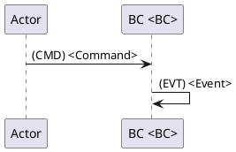
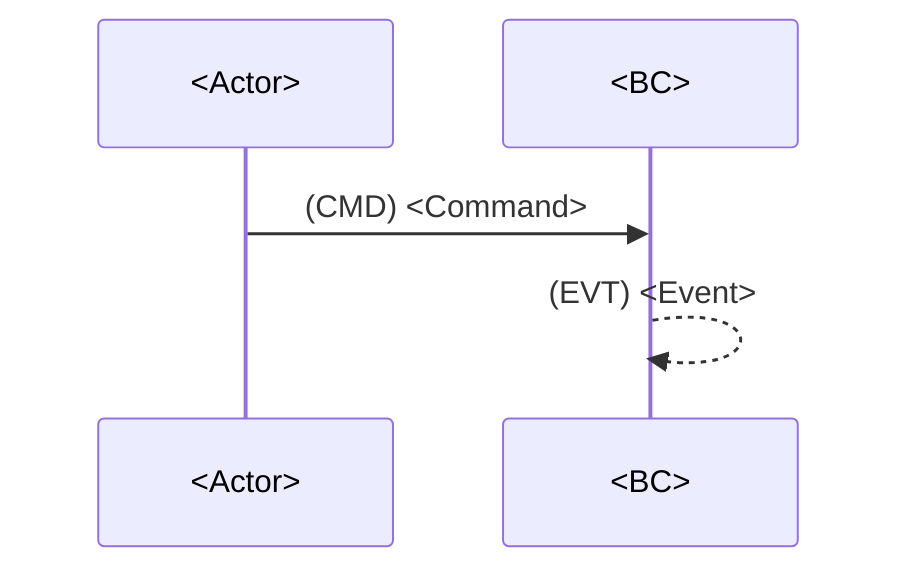

# Карта процесса (последовательность событий): Process Map (Event Sequence)

<!-- 
> **Важно:** это **шаблон** (read-only) в `.requirements/**`.
> Заполненная карта процесса создаётся в: `docs/requirements/сценарии/<domain_slug>/карта процесса.md`,
> где `<domain_slug>` берётся из `docs/requirements/домены/реестр.md`.
Назначение: зафиксировать цепочки событий по ключевым юзкейсам (Event Storming / Process Modeling).
Правила:
- События (EVT) — в прошедшем времени: "Заказ подтверждён".
- Команды (CMD) — повелительное: "Подтвердить заказ".
- Политики/правила (POL) — "Если ..., то ...".
- Порядок слева-направо по времени. Альтернативы — отдельными ветками/сценариями. -->

## 0. Контекст документа
- **Проект / продукт:** `<PROJECT_NAME>`
- **Домен (slug из реестра):** `<domain_slug>`
- **Источник домена:** `docs/requirements/домены/<domain_slug>.md`
- **Дата сессии:** `<YYYY-MM-DD>`
- **Участники:** `<names/roles>`
- **Область покрытия (scope):** `<what is included/excluded>`
- **Нотация:** `EVT / CMD / POL / ACTOR / EXT / READMODEL`

## 1. Глоссарий
- **EVT (Domain Event):** `<definition>`
- **CMD (Command):** `<definition>`
- **POL (Policy):** `<definition>`
- **BC (Bounded Context):** `<definition>` *(в рамках домена, если применимо)*
- **correlationId / causationId:** `<definition>`

## 2. Участники и контексты
### 2.1 Actors
- **<Actor1>:** `<description>`
- **<Actor2>:** `<description>`

### 2.2 Ограниченные контексты (BC) внутри домена (если применимо)
- **<BC1>:** `<responsibility>`
- **<BC2>:** `<responsibility>`
- **<BC3>:** `<responsibility>`

### 2.3 Внешние системы (EXT)
- **<EXT1>:** `<description>`
- **<EXT2>:** `<description>`

## 3. Связь с требованиями (обязательно)
> Трассировка: указываем требования, которые покрывает этот процесс/сценарии.

- `<REQ-ID-001> / docs/requirements/требования/<...>#<anchor>`
- `<REQ-ID-002> / docs/requirements/требования/<...>#<anchor>`

---

## 4. Список юзкейсов (Use Cases)
> Для каждого UC ниже должна быть своя “последовательность”.

- **UC-01:** `<name>` — `<goal>`
- **UC-02:** `<name>` — `<goal>`
- **UC-03:** `<name>` — `<goal>`

---

## 5. UC-01: <Use case name>
**Цель:** `<goal>`  
**Триггер:** `<actor/action>`  
**Результат:** `<business outcome>`  
**Предусловия:** `<preconditions>`  
**Постусловия:** `<postconditions>`

### 5.1 Lanes (дорожки)
- **ACTOR:** `<Actor>`
- **BC:** `<BC1>`, `<BC2>`, `<BC3>` *(если есть)*
- **EXT:** `<EXT1>` *(если есть)*
- **READMODEL:** `<RM1>` *(если есть)*

### 5.2 Основная последовательность (Happy Path)
> Формат шага: `N. <Lane> → (CMD|POL|EVT) <Name> [-> <Lane>] — <notes>`

1. `<Actor/BC>` → **(CMD) `<CommandName>`** → `<BC>` — `<краткое описание>`
2. `<BC>` → **(EVT) `<EventName>`** — `<факт домена, что произошло>`
3. `<BC>` → **(POL) `<PolicyName>`** → `<BC/EXT>` — `<условие/правило>`
4. `<BC>` → **(CMD) `<CommandName>`** → `<BC>` — `<действие>`
5. `<BC>` → **(EVT) `<EventName>`** — `<факт>`
6. `<EXT>` → **(EVT) `<EventName>`** → `<BC>` — `<callback/webhook, если есть>`
7. `...`

### 5.3 Данные и идентификаторы (минимум)
- **correlationId:** `<what ties the flow together>`
- **causationId:** `<what caused the current action/event>`
- **Основные ID:** `<entityId1>`, `<entityId2>`, `<processId>`
- **Ключевые поля payload:**
  - `<field1>`: `<meaning>`
  - `<field2>`: `<meaning>`

### 5.4 Инварианты и правила (Business Rules)
- **BR-01:** `<rule>`
- **BR-02:** `<rule>`
- **BR-03:** `<rule>`

### 5.5 Чтение/проекции (Read Models) — если применимо
- **RM-01:** `<projection name>` — источник: `<events>` — используется: `<UI/API/report>`
- **RM-02:** `...`

### 5.6 Альтернативы / исключения
#### UC-01A: <Alternative name>
**Условие:** `<when it happens>`

1. `...`
2. `...`

#### UC-01B: <Alternative name>
**Условие:** `<when it happens>`

1. `...`
2. `...`

### 5.7 Пробелы и неопределённости (обязательно при отсутствии фактов)
> Если данных не хватает — фиксировать как `Не определено источниками`.

- `Не определено источниками: <что именно>`
- `Не определено источниками: <что именно>`

### 5.8 Нерешённые вопросы (Parking Lot)
- [ ] `<question 1>`
- [ ] `<question 2>`

---

## 6. UC-02: <Use case name>
> Скопируй структуру из UC-01.

---

## 7. Выделенные агрегаты (Aggregates)

> **Назначение:** извлечь агрегаты из сценариев для передачи на этап "Структура данных".
> Агрегат = кластер сущностей с единой границей согласованности и корневой сущностью (Aggregate Root).

### 7.1 Реестр агрегатов домена

| ID | Агрегат | Root Entity | Связанные сущности | Источник (UC/EVT) | Инварианты |
|----|---------|-------------|-------------------|-------------------|------------|
| AGG-001 | `<AggregateName>` | `<RootEntity>` | `<Entity1>`, `<Entity2>` | UC-01, EVT: `<EventName>` | BR-01, BR-02 |
| AGG-002 | `<AggregateName>` | `<RootEntity>` | `<Entity1>` | UC-02, CMD: `<CommandName>` | BR-03 |

### 7.2 Детализация агрегатов

#### AGG-001: `<AggregateName>`

- **Root Entity:** `<RootEntity>` — `<описание>`
- **Identity:** `<entityId>` (тип: `<UUID/string/int>`)
- **Связанные сущности:**
  - `<Entity1>` — `<описание, связь с root>`
  - `<Entity2>` — `<описание, связь с root>`
- **Value Objects:**
  - `<VO1>` — `<описание>`
- **Инварианты (из BR):**
  - BR-01: `<rule>`
  - BR-02: `<rule>`
- **События агрегата:**
  - `<EventName1>` — когда: `<условие>`
  - `<EventName2>` — когда: `<условие>`
- **Команды агрегата:**
  - `<CommandName1>` — что делает: `<описание>`

#### AGG-002: `<AggregateName>`
> Скопируй структуру из AGG-001.

### 7.3 Связь агрегатов между собой

| Агрегат A | Связь | Агрегат B | Механизм | Примечание |
|-----------|-------|-----------|----------|------------|
| AGG-001 | references | AGG-002 | `<entityId>` | `<описание>` |
| AGG-002 | publishes to | AGG-001 | EVT: `<EventName>` | `<описание>` |

### 7.4 Передача в структуру данных

> После завершения этапа сценариев агрегаты используются как вход для:
> - `docs/requirements/структура Данных/описание БД.md`
> - Карточки объектов данных по шаблону `.requirements/структура Данных/шаблоны карточек.md`

---

## 8. Итоги и принятые решения
- **Decision-01:** `<decision>` *(дата/участники)*
- **Decision-02:** `<decision>`

## 9. Приложение (опционально)
### 9.1 PlantUML (если нужно)

### 9.2 Mermaid (если нужно)

