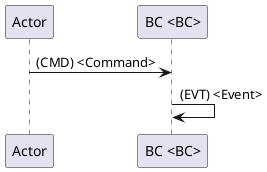
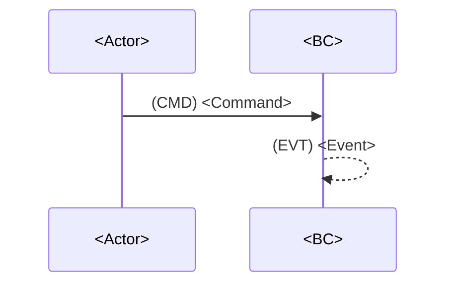

# Составь карту процесса (H6)

Процедура этапа [5.1] из `.requirements/трек разработки.md`.

> **Важно:** это **шаблон** (read-only) в `.requirements/**`.
> Результат создаётся в: `docs/requirements/сценарии/<domain_slug>/карта процесса.md`.

---

**Входные данные:**
- `docs/requirements/домены/<domain_slug>.md` (этап [4])
- `docs/requirements/требования/**` (этап [3])

**Выходные данные:**
- `docs/requirements/сценарии/<domain_slug>/карта процесса.md` (H8)

---

**Правила формирования:**
- События (EVT) — в прошедшем времени: "Заказ подтверждён"
- Команды (CMD) — повелительное: "Подтвердить заказ"
- Политики/правила (POL) — "Если ..., то ..."
- Порядок слева-направо по времени. Альтернативы — отдельными ветками

---

## Примеры заполнения (ОБЯЗАТЕЛЬНО изучить перед созданием)

> **Важно:** Примеры ниже носят иллюстративный характер. Конкретные UC, события,
> команды и данные должны определяться на основе предметной области и требований
> конкретного проекта, а не копироваться из примера.

### Считать верным: Достаточная детализация UC

```markdown
## UC-01: Создание заказа

**Цель:** Клиент создаёт заказ с выбранными товарами
**Триггер:** Customer нажимает "Оформить заказ" в корзине
**Результат:** Заказ создан, товары зарезервированы, клиент получил номер заказа
**Предусловия:** Корзина не пуста, клиент авторизован
**Постусловия:** Order в статусе DRAFT, резерв на складе создан

### Lanes (дорожки)
- **ACTOR:** Customer
- **BC:** Order-BC, Inventory-BC
- **EXT:** Payment Gateway (на следующем шаге)

### Основная последовательность (Happy Path)

1. Customer -> **(CMD) CreateOrder** -> Order-BC — клиент инициирует создание заказа
2. Order-BC -> **(CMD) CheckAvailability** -> Inventory-BC — проверка наличия товаров
3. Inventory-BC -> **(EVT) AvailabilityChecked** — товары доступны
4. Order-BC -> **(POL) If all items available** -> Order-BC — правило: все товары должны быть в наличии
5. Order-BC -> **(CMD) ReserveItems** -> Inventory-BC — резервирование товаров
6. Inventory-BC -> **(EVT) ItemsReserved** — товары зарезервированы
7. Order-BC -> **(EVT) OrderCreated** — заказ создан
8. Order-BC -> **(EVT) OrderDraftReady** -> Customer — уведомление клиенту

### Данные и идентификаторы
- **correlationId:** `orderId` (UUID, генерируется при CreateOrder)
- **causationId:** `cartId` (корзина, из которой создан заказ)
- **Ключевые поля payload:**
  - `orderId`: UUID заказа
  - `customerId`: ID клиента
  - `items`: [{productId, quantity, price}]
  - `totalAmount`: сумма заказа

### Инварианты (Business Rules)
- **BR-01:** Заказ не может быть создан с пустым списком товаров
- **BR-02:** Сумма заказа = сумма (price * quantity) по всем items
- **BR-03:** Резерв действителен 30 минут, затем автоматически снимается

### Альтернативы
#### UC-01A: Товар недоступен
**Условие:** AvailabilityChecked вернул `available: false` для одного или более товаров

1. Inventory-BC -> **(EVT) ItemUnavailable** — товар недоступен
2. Order-BC -> **(EVT) OrderCreationFailed** -> Customer — уведомление с причиной
```

### Считать неверным: Недостаточная детализация

```markdown
## Карта процесса домена Order Management

## Назначение
Управление заказами.

## Поток/этапы
1. Создание заказа
2. Подтверждение заказа
3. Оплата
4. Доставка
5. Завершение

## Входы и выходы
- Входы: данные заказа
- Выходы: заказ

## Пробелы
- Не требуется
```

**Почему неверно:**
- Нет детализации UC с целью, триггером, результатом
- Нет последовательности CMD/EVT/POL
- Нет lanes (кто с кем взаимодействует)
- Нет идентификаторов и payload
- Нет бизнес-правил (инвариантов)
- Нет альтернативных сценариев
- **Невозможно построить диаграмму** на основе этих данных

---

## Минимальные критерии детализации карты процесса

| Элемент | Минимум | Как проверить |
|---------|---------|---------------|
| **UC в домене** | >= 1 UC на домен | Каждый домен имеет хотя бы один сценарий |
| **Шаги в UC** | >= 5 шагов в Happy Path | Последовательность CMD/EVT/POL >= 5 |
| **CMD в UC** | >= 2 команды | Действия, инициирующие изменения |
| **EVT в UC** | >= 2 события | Факты, произошедшие в домене |
| **Lanes** | >= 2 участника | Actor + минимум 1 BC или EXT |
| **Идентификаторы** | correlationId + >= 2 ключевых поля | Данные для трассировки |
| **Инварианты** | >= 1 BR на UC | Бизнес-правила, которые нельзя нарушить |
| **Альтернативы** | >= 1 на UC (если есть ветвления) | Обработка ошибок или альтернативный путь |

**Правило:** если UC не проходит минимум — детализируй.

---

## Правила извлечения данных для карты процесса

| Откуда | Что извлекать | Куда |
|--------|---------------|------|
| Предметная область, раздел 5 (UC) | Верхнеуровневые сценарии | Список UC (раздел 4) |
| Предметная область, раздел 3 (Actors) | Участники | Lanes -> ACTOR |
| Предметная область, раздел 4 (Entities) | Сущности, состояния | Идентификаторы, payload |
| Предметная область, раздел 4.3 (BR) | Бизнес-правила | Инварианты, POL |
| Карточка домена, `owned_data` | Сущности домена | BC, агрегаты |
| Карточка домена, `interfaces` | Связи с другими доменами | Lanes -> EXT, интеграции |
| Требования, FR-* | Функции | CMD (что система должна делать) |

---

## Процедура заполнения (подтверждение кандидатов)

> **Критически важно:** НЕ детализируй UC без подтверждения разработчика.

### Шаг 1. Извлечение кандидатов UC

Из предметной области и требований извлеки:
- Верхнеуровневые UC (раздел 5 предметной области)
- Акторов и их цели
- Ключевые сущности и их состояния

### Шаг 2. Формирование блока подтверждения

**Формат блока:**

```
КАНДИДАТЫ UC ДЛЯ ДОМЕНА <domain_slug> — ТРЕБУЕТСЯ ПОДТВЕРЖДЕНИЕ

На основе предметной области и требований выделены сценарии:

UC-01: <название>
- Актор: <кто инициирует>
- Цель: <что хочет достичь>
- Триггер: <что запускает>
- Покрывает FR: <список>

UC-02: <название>
- Актор: <кто инициирует>
- Цель: <что хочет достичь>
- Триггер: <что запускает>
- Покрывает FR: <список>

Предполагаемые ключевые события:
- <EventName1> — <когда происходит>
- <EventName2> — <когда происходит>

Вопросы для уточнения (если есть):
- <вопрос о неясности в требованиях>

Пожалуйста, подтвердите список UC или укажите корректировки.
```

### Шаг 3. Ожидание подтверждения

Дождись ответа разработчика:
- "Подтверждаю" — переход к детализации
- Корректировки — внеси изменения и повтори подтверждение

### Шаг 4. Детализация после подтверждения

После подтверждения:
1. Создай детальные UC по шаблону (см. примеры выше)
2. Заполни последовательности CMD/EVT/POL
3. Добавь идентификаторы и payload
4. Пропиши инварианты и альтернативы

**Почему это важно:**
- UC определяют события и команды для каталога мероприятий
- Неверный UC = неверные события = неверная архитектура
- Разработчик может знать неявные требования, не зафиксированные в документах

---

## Трансформация: UC из предметной области -> детальный UC

**Вход (из предметной области):**
```
UC-01: Контроль изменения через quality gates
- Цель: принять изменение только при прохождении обязательных проверок
- Актёр: Developer / AI Agent
- Триггер: создание PR
```

**Выход (детальный UC в карте процесса):**
```
UC-01: Контроль изменения через quality gates

**Цель:** принять изменение только при прохождении обязательных проверок
**Триггер:** Developer/AI Agent создаёт Pull Request
**Результат:** PR принят (merged) или отклонён (blocked) с причиной
**Предусловия:** Определены обязательные quality gates в конфигурации
**Постусловия:** PR имеет статус APPROVED или BLOCKED

### Lanes
- **ACTOR:** Developer, AI Agent
- **BC:** QualityGate-BC, PR-BC
- **EXT:** CI System, GitHub API

### Основная последовательность
1. Developer -> **(CMD) CreatePullRequest** -> PR-BC
2. PR-BC -> **(EVT) PullRequestCreated** -> QualityGate-BC
3. QualityGate-BC -> **(CMD) TriggerChecks** -> CI System
4. CI System -> **(EVT) CheckStarted** — запуск проверок
5. CI System -> **(EVT) CheckCompleted** -> QualityGate-BC — результаты проверок
6. QualityGate-BC -> **(POL) If all checks passed** -> PR-BC
7. PR-BC -> **(EVT) PullRequestApproved** | **(EVT) PullRequestBlocked**
```

---

## 0. Контекст документа
- **Проект / продукт:** `<PROJECT_NAME>`
- **Домен (slug из реестра):** `<domain_slug>`
- **Источник домена:** `docs/requirements/домены/<domain_slug>.md`
- **Дата сессии:** `<YYYY-MM-DD>`
- **Участники:** `<names/roles>`
- **Область покрытия (scope):** `<what is included/excluded>`
- **Нотация:** `EVT / CMD / POL / ACTOR / EXT / READMODEL`

## 1. Глоссарий
- **EVT (Domain Event):** `<definition>`
- **CMD (Command):** `<definition>`
- **POL (Policy):** `<definition>`
- **BC (Bounded Context):** `<definition>` *(в рамках домена, если применимо)*
- **correlationId / causationId:** `<definition>`

## 2. Участники и контексты
### 2.1 Actors
- **<Actor1>:** `<description>`
- **<Actor2>:** `<description>`

### 2.2 Ограниченные контексты (BC) внутри домена (если применимо)
- **<BC1>:** `<responsibility>`
- **<BC2>:** `<responsibility>`
- **<BC3>:** `<responsibility>`

### 2.3 Внешние системы (EXT)
- **<EXT1>:** `<description>`
- **<EXT2>:** `<description>`

## 3. Связь с требованиями (обязательно)
> Трассировка: указываем требования, которые покрывает этот процесс/сценарии.

- `<REQ-ID-001> / docs/requirements/требования/<...>#<anchor>`
- `<REQ-ID-002> / docs/requirements/требования/<...>#<anchor>`

---

## 4. Список юзкейсов (Use Cases)
> Для каждого UC ниже должна быть своя “последовательность”.

- **UC-01:** `<name>` — `<goal>`
- **UC-02:** `<name>` — `<goal>`
- **UC-03:** `<name>` — `<goal>`

---

## 5. UC-01: <Use case name>
**Цель:** `<goal>`  
**Триггер:** `<actor/action>`  
**Результат:** `<business outcome>`  
**Предусловия:** `<preconditions>`  
**Постусловия:** `<postconditions>`

### 5.1 Lanes (дорожки)
- **ACTOR:** `<Actor>`
- **BC:** `<BC1>`, `<BC2>`, `<BC3>` *(если есть)*
- **EXT:** `<EXT1>` *(если есть)*
- **READMODEL:** `<RM1>` *(если есть)*

### 5.2 Основная последовательность (Happy Path)
> Формат шага: `N. <Lane> → (CMD|POL|EVT) <Name> [-> <Lane>] — <notes>`

1. `<Actor/BC>` → **(CMD) `<CommandName>`** → `<BC>` — `<краткое описание>`
2. `<BC>` → **(EVT) `<EventName>`** — `<факт домена, что произошло>`
3. `<BC>` → **(POL) `<PolicyName>`** → `<BC/EXT>` — `<условие/правило>`
4. `<BC>` → **(CMD) `<CommandName>`** → `<BC>` — `<действие>`
5. `<BC>` → **(EVT) `<EventName>`** — `<факт>`
6. `<EXT>` → **(EVT) `<EventName>`** → `<BC>` — `<callback/webhook, если есть>`
7. `...`

### 5.3 Данные и идентификаторы (минимум)
- **correlationId:** `<what ties the flow together>`
- **causationId:** `<what caused the current action/event>`
- **Основные ID:** `<entityId1>`, `<entityId2>`, `<processId>`
- **Ключевые поля payload:**
  - `<field1>`: `<meaning>`
  - `<field2>`: `<meaning>`

### 5.4 Инварианты и правила (Business Rules)
- **BR-01:** `<rule>`
- **BR-02:** `<rule>`
- **BR-03:** `<rule>`

### 5.5 Чтение/проекции (Read Models) — если применимо
- **RM-01:** `<projection name>` — источник: `<events>` — используется: `<UI/API/report>`
- **RM-02:** `...`

### 5.6 Альтернативы / исключения
#### UC-01A: <Alternative name>
**Условие:** `<when it happens>`

1. `...`
2. `...`

#### UC-01B: <Alternative name>
**Условие:** `<when it happens>`

1. `...`
2. `...`

### 5.7 Пробелы и неопределённости (обязательно при отсутствии фактов)
> Если данных не хватает — фиксировать как `Не определено источниками`.

- `Не определено источниками: <что именно>`
- `Не определено источниками: <что именно>`

### 5.8 Нерешённые вопросы (Parking Lot)
- [ ] `<question 1>`
- [ ] `<question 2>`

---

## 6. UC-02: <Use case name>
> Скопируй структуру из UC-01.

---

## 7. Выделенные агрегаты (Aggregates)

> **Назначение:** извлечь агрегаты из сценариев для передачи на этап "Структура данных".
> Агрегат = кластер сущностей с единой границей согласованности и корневой сущностью (Aggregate Root).

### 7.1 Реестр агрегатов домена

| ID | Агрегат | Root Entity | Связанные сущности | Источник (UC/EVT) | Инварианты |
|----|---------|-------------|-------------------|-------------------|------------|
| AGG-001 | `<AggregateName>` | `<RootEntity>` | `<Entity1>`, `<Entity2>` | UC-01, EVT: `<EventName>` | BR-01, BR-02 |
| AGG-002 | `<AggregateName>` | `<RootEntity>` | `<Entity1>` | UC-02, CMD: `<CommandName>` | BR-03 |

### 7.2 Детализация агрегатов

#### AGG-001: `<AggregateName>`

- **Root Entity:** `<RootEntity>` — `<описание>`
- **Identity:** `<entityId>` (тип: `<UUID/string/int>`)
- **Связанные сущности:**
  - `<Entity1>` — `<описание, связь с root>`
  - `<Entity2>` — `<описание, связь с root>`
- **Value Objects:**
  - `<VO1>` — `<описание>`
- **Инварианты (из BR):**
  - BR-01: `<rule>`
  - BR-02: `<rule>`
- **События агрегата:**
  - `<EventName1>` — когда: `<условие>`
  - `<EventName2>` — когда: `<условие>`
- **Команды агрегата:**
  - `<CommandName1>` — что делает: `<описание>`

#### AGG-002: `<AggregateName>`
> Скопируй структуру из AGG-001.

### 7.3 Связь агрегатов между собой

| Агрегат A | Связь | Агрегат B | Механизм | Примечание |
|-----------|-------|-----------|----------|------------|
| AGG-001 | references | AGG-002 | `<entityId>` | `<описание>` |
| AGG-002 | publishes to | AGG-001 | EVT: `<EventName>` | `<описание>` |

### 7.4 Передача в структуру данных

> После завершения этапа сценариев агрегаты используются как вход для:
> - `docs/requirements/структура Данных/описание БД.md`
> - Карточки объектов данных по шаблону `.requirements/структура Данных/шаблоны карточек.md`

---

## 8. Итоги и принятые решения
- **Decision-01:** `<decision>` *(дата/участники)*
- **Decision-02:** `<decision>`

## 9. Приложение (опционально)
### 9.1 PlantUML (если нужно)


### 9.2 Mermaid (если нужно)



---

## Критерии готовности этапа [5.1]

### Минимальные (блокируют переход к [5.2])

- [ ] **UC в домене:** >= 1 UC с полным описанием (цель, триггер, результат, пред/постусловия)
- [ ] **Шаги Happy Path:** >= 5 шагов в последовательности CMD/EVT/POL
- [ ] **Lanes:** >= 2 участника (Actor + минимум 1 BC или EXT)
- [ ] **Идентификаторы:** correlationId + >= 2 ключевых поля payload
- [ ] **Инварианты:** >= 1 BR на UC
- [ ] **Связь с требованиями:** раздел 3 заполнен, есть ссылки на FR-*
- [ ] **H8 создан:** `docs/requirements/сценарии/<domain_slug>/карта процесса.md`

### Рекомендуемые

- [ ] **Альтернативы:** >= 1 альтернативный сценарий на UC (если есть ветвления)
- [ ] **Read Models:** указаны проекции, если применимо
- [ ] **Агрегаты:** раздел 7 заполнен (если есть агрегаты)
- [ ] **Диаграммы:** PlantUML/Mermaid в разделе 9

### Gap Tracking

- [ ] `gap-tracking.md` ОБЯЗАТЕЛЬНО обновлен (пустая таблица = валидный результат превентивной проверки)
- [ ] Все пробелы зафиксированы с приоритетами (HIGH/MEDIUM/LOW)
- [ ] Пробелы помечены в разделе 5.7 как `Не определено источниками`
- [ ] НЕТ придуманных данных — только GAP
