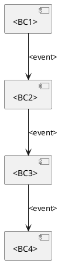
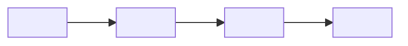

# Ограниченные контексты + Интеграционные события (Bounded Contexts + Integration Events)

<!--
Назначение: описать границы доменной модели (BC), ответственности, владение данными,
и матрицу интеграций (кто публикует/кто подписывается на события, какие команды/интерфейсы доступны).
Правило репозитория:
- `.requirements/**` — методики/шаблоны (read-only)
- `docs/**` — фактические артефакты проекта (source of truth)
-->

## 0. Контекст документа
- **Проект / продукт:** <PROJECT_NAME>
- **Домен (domain_slug):** <domain_slug> <!-- берётся только из `docs/requirements/домены/реестр.md` -->
- **Дата обновления:** <YYYY-MM-DD>

- **Связанные документы (документы проекта):**
  - Domain Card: `docs/requirements/домены/<domain_slug>.md`
  - Process Map: `docs/requirements/сценарии/<domain_slug>/карта процесса.md`
  - Event Catalog: `docs/requirements/сценарии/<domain_slug>/каталог мероприятий.md`

- **Методика (read-only, если нужна ссылка):**
  - Rules: `.requirements/сценарии/правила.md`

---

## 1. Связь домена и Bounded Context

> **Терминология (см. `.requirements/домены/определение доменов.md`):**
> - **Домен** — высокоуровневая бизнес-область (стратегический уровень)
> - **Bounded Context (BC)** — технический подконтекст внутри домена (тактический уровень)
>
> **Правила:**
> - Для простых доменов: 1 домен = 1 BC (раздел ниже можно пропустить, контекст = сам домен)
> - Для сложных доменов: 1 домен = N BC (заполнить раздел ниже)
> - Если BC не выделяются явно, весь домен считается единым контекстом

---

## 2. Список Bounded Context
> Коротко: "кто за что отвечает и какими данными владеет".

### BC-01: <BC Name>
- **Назначение:** <responsibility>
- **Владелец (команда):** <team>
- **Сервисы/модули:** <service list>
- **Данные (source of truth):** <entities/tables/collections>
- **Основные инварианты:** <rules>
- **Публичные интерфейсы:**
  - API: <REST/GRPC/GraphQL>
  - Async: <events published/subscribed>
- **Нефункциональные требования (NFR/SLO):** <latency/availability/throughput>

### BC-02: <BC Name>
> Скопируй структуру BC-01

### BC-03: <BC Name>
> ...

---

## 3. Context Map (взаимоотношения контекстов)
> Опиши типы отношений: Customer/Supplier, Conformist, ACL, Shared Kernel и т.п.

- **<BC1> → <BC2>:** <relationship type> — <notes>
- **<BC2> → <BC3>:** <relationship type> — <notes>

### 3.1 Anti-Corruption Layer (ACL) (если есть)
- **Где:** <between which BCs>
- **Зачем:** <what model mismatch it isolates>
- **Артефакты:** <mappers/adapters/contracts>

---

## 4. Integration Matrix (Publish / Subscribe)
> Основная таблица интеграционных событий между BC.

| Publisher (BC) | Event | Subscribers (BC) | Канал (Kafka/Rabbit/HTTP/etc) | Гарантии доставки | Ordering key | Примечания |
|---|---|---|---|---|---|---|
| <BC> | <EventName> | <BC1,BC2> | <channel> | <at-least-once> | <key> | <notes> |
| <BC> | <EventName> |  |  |  |  |  |

---

## 5. Контракты интеграции (ссылки и правила)
- **Schema registry / AsyncAPI / JSON Schema:** <link/path>
- **Версионирование событий:** <rules>
- **Backwards compatibility:** <rules>
- **Idempotency:** <rules>
- **DLQ / retry policy:** <rules>

---

## 6. Команды и синхронные вызовы (опционально)
> Если помимо событий есть команды через API.

### 6.1 API Contracts
| Consumer | Provider (BC/service) | Operation | Input | Output | SLA | Notes |
|---|---|---|---|---|---|---|
| <BC> | <BC> | <POST /orders> | <dto> | <dto> | <ms> |  |

### 6.2 Команды (CMD) на границах
| Command | От кого | К кому (BC) | Валидирует | Порождает события | Notes |
|---|---|---|---|---|---|
| <CommandName> | <Actor/BC> | <BC> | <rules> | <EVTs> |  |

---

## 6. Владение данными и согласованность
- **Модель согласованности:** <eventual/strong> по доменным объектам <...>
- **Саги/оркестрация:** <where> (если применимо)
- **Источник истинности:**
  - <entity> → <BC>
  - <entity> → <BC>

---

## 7. Риски и ограничения
- **R-01:** <risk> → <mitigation>
- **R-02:** ...

---

## 8. Parking Lot (вопросы)
- [ ] <open question 1>
- [ ] <open question 2>

---

## 9. Приложение (опционально)

### 9.1 PlantUML: Context Map (пример)

### 9.2 Mermaid: Context Map (пример)

