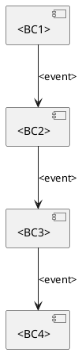
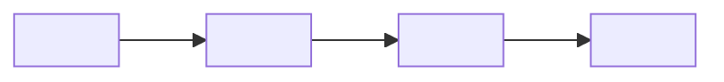

# Определи ограниченные контексты (H6)

Процедура этапа [5.3] из `.requirements/трек разработки.md`.

> **Важно:** это **шаблон** (read-only) в `.requirements/**`.
> Результат создаётся в: `docs/requirements/сценарии/<domain_slug>/ограниченные контексты.md`.
> **Подходы:** `.approach/context-map.md`, `.approach/ddd-patterns.md`.

---

**Входные данные:**
- `docs/requirements/домены/<domain_slug>.md` (этап [4])
- `docs/requirements/сценарии/<domain_slug>/каталог мероприятий.md` (этап [5.2])

**Выходные данные:**
- `docs/requirements/сценарии/<domain_slug>/ограниченные контексты.md` (H8)

---

**Назначение:** описать границы доменной модели (BC), ответственности, владение данными и матрицу интеграций.

---

## Примеры заполнения (ОБЯЗАТЕЛЬНО изучить перед созданием)

> **Важно:** Примеры ниже носят иллюстративный характер. Конкретные BC, их связи
> и интеграционные события должны определяться на основе предметной области
> и требований конкретного проекта, а не копироваться из примера.

### Считать верным: Достаточная детализация

**Список BC:**

```markdown
### BC-01: Order Processing

- **Назначение:** Создание, валидация и управление жизненным циклом заказов
- **Владелец (команда):** Order Team
- **Сервисы/модули:** order-service, order-validator
- **Данные (source of truth):**
  - Order (aggregate): id, status, items, total, customer_id
  - OrderItem: product_id, quantity, price
- **Основные инварианты:**
  - Заказ не может быть пустым (items.length > 0)
  - Сумма заказа = сумма цен items
  - Статус меняется только по определённым переходам (state machine)
- **Публичные интерфейсы:**
  - API: POST /orders, GET /orders/{id}, PATCH /orders/{id}/cancel
  - Async: публикует OrderCreated, OrderConfirmed, OrderCancelled
  - Async: подписан на PaymentCompleted, ItemsReserved
- **NFR/SLO:** latency p99 < 200ms, availability 99.9%
```

**Context Map:**

```markdown
## Context Map

- **Order Processing -> Inventory:** Customer/Supplier (U/D)
  - Order Processing запрашивает резервирование
  - Inventory выполняет и отвечает событием

- **Order Processing -> Payment:** Customer/Supplier (U/D)
  - Order Processing инициирует платёж
  - Payment подтверждает или отклоняет

- **Order Processing <- Notification:** Conformist (CF)
  - Notification подписывается на события Order Processing
  - Принимает модель заказа как есть
```

**Integration Matrix:**

| Publisher (BC) | Event | Subscribers | Канал | Гарантии | Ordering key |
|----------------|-------|-------------|-------|----------|--------------|
| Order Processing | OrderCreated | Inventory, Notification | Kafka: orders | at-least-once | orderId |
| Order Processing | OrderConfirmed | Fulfillment, Analytics | Kafka: orders | at-least-once | orderId |
| Inventory | ItemsReserved | Order Processing | Kafka: inventory | at-least-once | orderId |
| Payment | PaymentCompleted | Order Processing | Kafka: payments | at-least-once | paymentId |

### Считать неверным: Недостаточная детализация

```markdown
## Ограниченные контексты домена Orders

## Контексты
- **BC-01:** Orders — единый контекст заказов

## Связь с требованиями
- FR-001, FR-002

## Пробелы
- Не определены подконтексты
```

**Почему неверно:**
- Только 1 BC без детализации
- Нет описания ответственности и данных
- Нет инвариантов
- Нет публичных интерфейсов (API/Events)
- Нет Context Map (связи между BC)
- Нет Integration Matrix
- **Невозможно построить архитектуру** на основе этих данных

---

## Минимальные критерии детализации

| Элемент | Минимум | Как проверить |
|---------|---------|---------------|
| **BC в домене** | >= 1 BC (или весь домен = 1 BC с пояснением) | Явно указано, почему не разбивается |
| **Описание BC** | >= 5 пунктов | Назначение, владелец, данные, инварианты, интерфейсы |
| **Данные BC** | >= 1 aggregate с атрибутами | Не просто название, а поля |
| **Инварианты** | >= 1 на BC | Бизнес-правила, которые BC гарантирует |
| **Публичные интерфейсы** | API + Events (если есть интеграции) | Что BC предоставляет наружу |
| **Context Map** | >= 1 связь (если > 1 BC или есть внешние) | Тип связи (U/D, CF, ACL, etc.) |
| **Integration Matrix** | Таблица для Integration Events | Publisher, Event, Subscribers, Channel |

**Правило:** если документ не проходит минимум — детализируй.

---

## Правила извлечения данных

| Откуда | Что извлекать | Куда |
|--------|---------------|------|
| Карта процесса, Lanes | BC участники | Список BC (раздел 2) |
| Карта процесса, последовательность | Взаимодействия между BC | Context Map (раздел 3) |
| Каталог мероприятий, реестр | Integration Events | Integration Matrix (раздел 4) |
| Карточка домена, `owned_data` | Сущности | Данные BC |
| Карточка домена, `interfaces` | Связи с другими доменами | Context Map, Integration Matrix |
| Карта процесса, инварианты | BR-* | Инварианты BC |

---

## Процедура заполнения (подтверждение BC)

> **Критически важно:** НЕ создавай детальное описание BC без подтверждения разработчика.

### Шаг 1. Анализ необходимости выделения BC

Определи:
- Нужно ли разбивать домен на BC (см. критерии ниже)
- Если домен = 1 BC — готовит обоснование
- Если домен = N BC — определяет кандидатов

### Шаг 2. Формирование блока подтверждения

**Формат блока (если выделяются BC):**

```
КАНДИДАТЫ BC ДЛЯ ДОМЕНА <domain_slug> — ТРЕБУЕТСЯ ПОДТВЕРЖДЕНИЕ

Анализ показал необходимость выделения нескольких BC:

BC-01: <название>
- Ответственность: <что делает>
- Данные: <какие агрегаты владеет>
- Команда/владелец: <кто отвечает>

BC-02: <название>
- Ответственность: <что делает>
- Данные: <какие агрегаты владеет>
- Команда/владелец: <кто отвечает>

Связи между BC:
- BC-01 -> BC-02: <тип связи, U/D/CF/ACL>
- BC-02 <- External: <тип связи>

Обоснование разделения:
- <почему не один BC>

Пожалуйста, подтвердите структуру BC или укажите корректировки.
```

**Формат блока (если домен = 1 BC):**

```
СТРУКТУРА BC ДЛЯ ДОМЕНА <domain_slug> — ТРЕБУЕТСЯ ПОДТВЕРЖДЕНИЕ

Анализ показал, что домен представлен единым Bounded Context.

Обоснование:
- <причина 1: единая команда / единая модель / тесная связность>
- <причина 2>

Связи с внешними BC/доменами:
- -> <external-domain>: <тип связи>
- <- <external-domain>: <тип связи>

Пожалуйста, подтвердите или укажите, если нужно разделение.
```

### Шаг 3. Ожидание подтверждения

Дождись ответа разработчика:
- "Подтверждаю" — переход к детализации
- Корректировки — внеси изменения и повтори подтверждение

### Шаг 4. Детализация после подтверждения

После подтверждения:
1. Создай детальные описания каждого BC (>= 5 пунктов)
2. Построй Context Map с типами связей
3. Заполняет Integration Matrix
4. Добавляет инварианты и публичные интерфейсы

**Почему это важно:**
- BC определяют границы микросервисов/модулей
- Неверное разделение = проблемы с зависимостями и владением данными
- Context Map критичен для понимания интеграций

---

## Когда выделять BC внутри домена

**Выделять BC, если:**
- Разные команды/люди отвечают за разные части домена
- Разные модели данных для разных функций
- Разные SLA/NFR для разных частей
- Есть явная граница транзакционной согласованности

**НЕ выделять BC (домен = 1 BC), если:**
- Маленький домен с единой ответственностью
- Одна команда, одна модель данных
- Все функции тесно связаны

**Если домен = 1 BC:**
```markdown
## 1. Связь домена и Bounded Context

Домен `order-management` представлен единым Bounded Context.

**Обоснование:** небольшой домен с единой командой, единой моделью данных,
все функции (создание, подтверждение, отмена заказа) тесно связаны
и требуют транзакционной согласованности.
```

---

## 0. Контекст документа
- **Проект / продукт:** <PROJECT_NAME>
- **Домен (domain_slug):** <domain_slug> <!-- берётся только из `docs/requirements/домены/реестр.md` -->
- **Дата обновления:** <YYYY-MM-DD>

- **Связанные документы (документы проекта):**
  - Domain Card: `docs/requirements/домены/<domain_slug>.md`
  - Process Map: `docs/requirements/сценарии/<domain_slug>/карта процесса.md`
  - Event Catalog: `docs/requirements/сценарии/<domain_slug>/каталог мероприятий.md`

- **Методика (read-only):**
  - Track: `.requirements/трек разработки.md` (Этап [5])

---

## 1. Связь домена и Bounded Context

> **Терминология (см. `.requirements/домены/определение доменов.md`):**
> - **Домен** — высокоуровневая бизнес-область (стратегический уровень)
> - **Bounded Context (BC)** — технический подконтекст внутри домена (тактический уровень)
>
> **Правила:**
> - Для простых доменов: 1 домен = 1 BC (раздел ниже можно пропустить, контекст = сам домен)
> - Для сложных доменов: 1 домен = N BC (заполнить раздел ниже)
> - Если BC не выделяются явно, весь домен считается единым контекстом

---

## 2. Список Bounded Context
> Коротко: "кто за что отвечает и какими данными владеет".

### BC-01: <BC Name>
- **Назначение:** <responsibility>
- **Владелец (команда):** <team>
- **Сервисы/модули:** <service list>
- **Данные (source of truth):** <entities/tables/collections>
- **Основные инварианты:** <rules>
- **Публичные интерфейсы:**
  - API: <REST/GRPC/GraphQL>
  - Async: <events published/subscribed>
- **Нефункциональные требования (NFR/SLO):** <latency/availability/throughput>

### BC-02: <BC Name>
> Скопируй структуру BC-01

### BC-03: <BC Name>
> ...

---

## 3. Context Map (взаимоотношения контекстов)
> Опиши типы отношений: Customer/Supplier, Conformist, ACL, Shared Kernel и т.п.

- **<BC1> → <BC2>:** <relationship type> — <notes>
- **<BC2> → <BC3>:** <relationship type> — <notes>

### 3.1 Anti-Corruption Layer (ACL) (если есть)
- **Где:** <between which BCs>
- **Зачем:** <what model mismatch it isolates>
- **Артефакты:** <mappers/adapters/contracts>

---

## 4. Integration Matrix (Publish / Subscribe)
> Основная таблица интеграционных событий между BC.

| Publisher (BC) | Event | Subscribers (BC) | Канал (Kafka/Rabbit/HTTP/etc) | Гарантии доставки | Ordering key | Примечания |
|---|---|---|---|---|---|---|
| <BC> | <EventName> | <BC1,BC2> | <channel> | <at-least-once> | <key> | <notes> |
| <BC> | <EventName> |  |  |  |  |  |

---

## 5. Контракты интеграции (ссылки и правила)
- **Schema registry / AsyncAPI / JSON Schema:** <link/path>
- **Версионирование событий:** <rules>
- **Backwards compatibility:** <rules>
- **Idempotency:** <rules>
- **DLQ / retry policy:** <rules>

---

## 6. Команды и синхронные вызовы (опционально)
> Если помимо событий есть команды через API.

### 6.1 API Contracts
| Consumer | Provider (BC/service) | Operation | Input | Output | SLA | Notes |
|---|---|---|---|---|---|---|
| <BC> | <BC> | <POST /orders> | <dto> | <dto> | <ms> |  |

### 6.2 Команды (CMD) на границах
| Command | От кого | К кому (BC) | Валидирует | Порождает события | Notes |
|---|---|---|---|---|---|
| <CommandName> | <Actor/BC> | <BC> | <rules> | <EVTs> |  |

---

## 7. Владение данными и согласованность
- **Модель согласованности:** <eventual/strong> по доменным объектам <...>
- **Саги/оркестрация:** <where> (если применимо)
- **Источник истинности:**
  - <entity> → <BC>
  - <entity> → <BC>

---

## 8. Риски и ограничения
- **R-01:** <risk> → <mitigation>
- **R-02:** ...

---

## 9. Parking Lot (вопросы)
- [ ] <open question 1>
- [ ] <open question 2>

---

## 10. Приложение (опционально)

### 10.1 PlantUML: Context Map (пример)


### 10.2 Mermaid: Context Map (пример)



---

## Критерии готовности этапа [5.3]

### Минимальные (блокируют переход к [5.4])

- [ ] **BC в домене:** >= 1 BC с полным описанием ИЛИ обоснование "домен = 1 BC"
- [ ] **Описание BC:** >= 5 пунктов (назначение, владелец, данные, инварианты, интерфейсы)
- [ ] **Данные BC:** >= 1 aggregate с указанием атрибутов
- [ ] **Инварианты:** >= 1 бизнес-правило на BC
- [ ] **Публичные интерфейсы:** указаны API и Events (если есть интеграции)
- [ ] **Context Map:** >= 1 связь с типом (U/D, CF, ACL, etc.) если > 1 BC или есть внешние
- [ ] **Integration Matrix:** таблица заполнена для Integration Events
- [ ] **H8 создан:** `docs/requirements/сценарии/<domain_slug>/ограниченные контексты.md`

### Рекомендуемые

- [ ] **NFR/SLO:** указаны для каждого BC (latency, availability)
- [ ] **ACL:** описан для интеграций с legacy/внешними системами
- [ ] **Владение данными:** раздел 6 заполнен (согласованность, саги)
- [ ] **Риски:** раздел 7 заполнен
- [ ] **Диаграммы:** PlantUML/Mermaid Context Map в разделе 9

### Gap Tracking

- [ ] `gap-tracking.md` обновлен (если есть пробелы)
- [ ] Открытые вопросы помечены в разделе 8 (Parking Lot)
- [ ] НЕТ придуманных BC — только факты из карты процесса и каталога мероприятий
